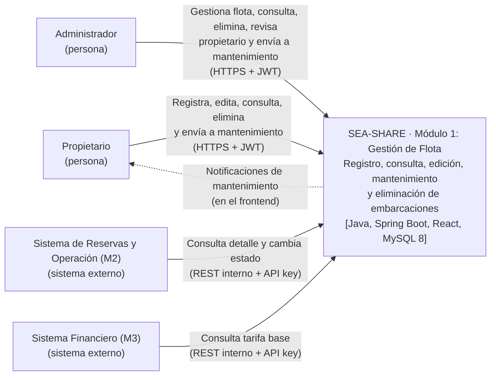

# UC07 — Asignar Estado Operativo (Internal REST)

| Campo                    | Valor                                                                                                |
| ------------------------ | ---------------------------------------------------------------------------------------------------- |
| **Caso de uso**          | UC07 Asignar Estado Operativo                                                                        |
| **SPEC**                 | `docs/features/007-asignar-estado-operativo/1-functional/spec.md`                                    |
| **Dirección**            | Sistema de Reservas y Operaciones (Módulo 2) → Módulo 1 (Gestión de Flota)                           |
| **¿Responde?**           | Sí (síncrono)                                                                                        |
| **Quién puede llamarlo** | Exclusivamente el Módulo 2 (`CU-08 Actualizar estado de reserva`) `[SPEC FR-002]`                    |
| **Efectos secundarios**  | Actualiza la entidad `Vessel` y asienta un registro inmutable en `status_change_log` `[SPEC FR-005]` |

---

## 1. Propósito

Permite al **Módulo de Reservas y Operaciones (Módulo 2)** sincronizar en tiempo real el estado operativo de una embarcación en M1 según los eventos del ciclo de vida de las reservas (bloqueos por pago, inicios de navegación, liberaciones o inhabilitaciones por avería) `[SPEC HU1, FR-007]`. Garantiza consistencia entre la disponibilidad comercial del catálogo y los compromisos operativos de las reservas `[SPEC SC-003]`.

---

## 2. Petición HTTP

`PATCH /internal/v1/vessels/{vessel_id}/status` `[CONV]` _(Aclaración acordada: Se utiliza PATCH por tratarse de una modificación parcial de atributos del activo)_.

### Headers

| Header                     | Obligatorio | Valor                                                  | Origen   |
| -------------------------- | ----------- | ------------------------------------------------------ | -------- |
| `X-Internal-Service-Token` | Sí          | Token de servicio interno backend-to-backend           | `[PEND]` |
| `Content-Type`             | Sí          | `application/json`                                     | `[CONV]` |
| `Accept`                   | No          | `application/json`                                     | `[CONV]` |
| `X-Correlation-Id`         | No          | Cadena de trazabilidad o identificador de evento de M2 | `[CONV]` |

### Parámetros de Ruta (Path Variables)

| Parámetro   | Tipo    | Oblig. | Descripción                                 | Origen          |
| ----------- | ------- | ------ | ------------------------------------------- | --------------- |
| `vessel_id` | UUID v4 | Sí     | Identificador único de la embarcación en M1 | `[SPEC FR-002]` |

### Cuerpo de la Petición (Request Body)

| Campo           | Tipo          | Oblig. | Descripción / Valores permitidos                                                                                                              | Origen |
| --------------- | ------------- | ------ | --------------------------------------------------------------------------------------------------------------------------------------------- | ------ |
| `target_status` | string (enum) | Sí     | Estado requerido: `"AVAILABLE"`, `"RESERVED"`, `"NAVIGATION"`, `"# Implementation Plan: Módulo 1 – Gestión de Flota y Activos P2P (SEA-SHARE) |

**Date**: 2026-10-09
**Spec**: `docs/features/001-…` a `docs/features/009-…` (UC01–UC09). **Única fuente de verdad.**
**Contratos**: `docs/architecture/contracts/` — (Pendiente de generación de archivos `.md` por contrato REST e integraciones internas).

---

## Summary

El **Módulo 1** es el inventario comercial central de SEA-SHARE: gestiona el ciclo de vida completo del CRUD de Embarcaciones, Puertos de Atraque, Servicios/Dotaciones y la Máquina de Estados Operativos. Además, expone endpoints internos críticos de consulta y cambio de estado que son consumidos directamente por el Módulo 2 (Reservas y Operaciones) y el Módulo 3 (Sistema Financiero).

Se implementa como una API REST backend independiente utilizando **Spring Boot 4.1.1** bajo **Arquitectura Hexagonal (Clean Architecture)** de tres capas únicas (`domain`, `application`, `infrastructure`), persistencia relacional con **Spring Data JPA** sobre **MySQL 8**, migraciones con **Flyway**, almacenamiento de fotografías en el sistema local, y pruebas de integración aisladas mediante **Testcontainers**.

El frontend (React + Vite) es un proyecto aparte que consume esta API. **Este plan cubre únicamente el backend.**

---

## Technical Context

**Language/Version**: Java 21 LTS (`java.version` 21)

**Primary Dependencies**:

- **Backend Framework**: Spring Boot 4.1.1 (`spring-boot-starter-web`, `spring-boot-starter-data-jpa`, `spring-boot-starter-validation`, `spring-boot-starter-security`, `spring-boot-starter-actuator`).
- **Herramientas de Soporte**: Flyway Migration, MapStruct, Lombok, Bean Validation.
- **Testing & Calidad**: JUnit 5, AssertJ, Mockito, **Testcontainers** (MySQL 8), ArchUnit.

**Storage**:

- Base de datos relacional **MySQL 8** para persistencia.
- Fotografías almacenadas en el sistema de archivos local del servidor (`/uploads/embarcaciones/`), conservando únicamente la ruta relativa en BD. En Docker, esa carpeta se monta como **volumen** en el `docker-compose.yml` para que las fotos sobrevivan a la recreación del contenedor.

**Target Platform**: Contenedores Docker (Linux); desarrollo local con Docker Compose.
**Project Type**: Servicio API REST Backend independiente (el frontend React + Vite vive en un proyecto separado).

**Constraints**:

- Matrícula legal (`legal_registration`) con formato estricto regex `^CP-\d{2}-\d{4}-[A-Z]$` única a nivel de BD.
- Capacidad de pasajeros entera > 0 con topes por tipo: Lancha ≤ 12, Velero ≤ 15, Catamarán ≤ 30, Yate ≤ 40.
- Tarifa base (`base_rate`) numérica > 0 COP sin límites.
- Fotografía JPG/PNG ≤ 10 MB obligatoria al completar registro y opcional en edición (solo reemplazo). Requiere configurar `spring.servlet.multipart.max-file-size=10MB` y `spring.servlet.multipart.max-request-size=10MB` (el valor por defecto de Spring es 1 MB).
- Servicios base obligatorios (_Capitán_ y _Combustible_) no removibles.
- Matrícula y Tipo bloqueados durante la edición.
- Edición y Eliminación permitidas únicamente en estados _Disponible_ y _En Mantenimiento/Limpieza_.

---

## 1. Alcance y trazabilidad SPEC → Componentes

| UC   | SPEC                           | Quién lo invoca            | Canal           | ¿Responde? | Contrato / Endpoint                                                                                                                                                                                                                       |
| ---- | ------------------------------ | -------------------------- | --------------- | ---------- | ----------------------------------------------------------------------------------------------------------------------------------------------------------------------------------------------------------------------------------------- |
| UC01 | 001 - Registrar embarcación    | Propietario                | REST            | Sí         | `GET /api/v1/fleet/vessels/drafts/current` (borrador vigente, para la modal)<br>`POST /api/v1/fleet/vessels` (paso 1: crea el borrador)<br>`POST /api/v1/fleet/vessels/{id}/complete` (paso 2: completa el registro y pasa a `AVAILABLE`) |
| UC02 | 002 - Cancelar registro        | Propietario                | REST            | Sí         | `DELETE /api/v1/fleet/vessels/drafts/{id}`                                                                                                                                                                                                |
| UC03 | 003 - Editar información       | Propietario                | REST            | Sí         | `PUT /api/v1/fleet/vessels/{id}`                                                                                                                                                                                                          |
| UC04 | 004 - Consultar información    | Propietario / Admin / M2   | REST / Internal | Sí         | `GET /api/v1/fleet/vessels` (listado: el propietario ve las suyas, el administrador todas)<br>`GET /api/v1/fleet/vessels/{id}`<br>`GET /internal/v1/vessels/{id}`                                                                         |
| UC05 | 005 - Enviar a mantenimiento   | Propietario / Admin        | REST            | Sí         | `POST /api/v1/fleet/vessels/{id}/maintenance` (enviar)<br>`POST /api/v1/fleet/vessels/{id}/maintenance/review-request` (propietario solicita revisión)<br>`POST /api/v1/fleet/vessels/{id}/maintenance/complete` (volver a `AVAILABLE`)   |
| UC06 | 006 - Eliminar registro        | Propietario / Admin        | REST            | Sí         | `DELETE /api/v1/fleet/vessels/{id}`                                                                                                                                                                                                       |
| UC07 | 007 - Asignar estado operativo | Módulo de Reservas (M2)    | Internal REST   | Sí         | `PATCH /internal/v1/vessels/{id}/status`                                                                                                                                                                                                  |
| UC08 | 008 - Consultar tarifa base    | Módulo de Liquidación (M3) | Internal REST   | Sí         | `GET /internal/v1/vessels/{id}/base-rate`                                                                                                                                                                                                 |
| UC09 | 009 - Revisar propietario      | Administrador              | REST            | Sí         | `GET /api/v1/admin/owners`                                                                                                                                                                                                                |

**Soporte transversal (sin UC propio):**

| Función          | Quién lo invoca     | Endpoint                                                               |
| ---------------- | ------------------- | ---------------------------------------------------------------------- |
| Inicio de sesión | Propietario / Admin | `POST /api/v1/auth/login` (público; devuelve el JWT)                   |
| Notificaciones   | Propietario         | `GET /api/v1/notifications`<br>`PATCH /api/v1/notifications/{id}/read` |

_El rol Cliente no existe en M1: sus consultas de detalle de embarcación llegan a través de M2 (conexión C1)._

---

## 2. Principios Rectores (Derivados de los SPEC)

1. **El Módulo 1 es el dueño de los datos de la embarcación (estado y tarifa)**: M3 solo consulta la tarifa base y nunca la asume. M2 consulta la información de la embarcación y es el responsable de las transiciones de la fase de reserva (Disponible → Reservado → En Navegación, y Reservado → Disponible si el pago vence en 15 minutos); M2 las solicita llamando al endpoint interno de M1, que las valida y las aplica. M1 es responsable de las demás transiciones (En Navegación → Mantenimiento y Mantenimiento → Disponible).
2. **Unicidad de Borradores**: Un propietario solo puede tener un registro incompleto (Borrador) activo a la vez. Si intenta iniciar un registro nuevo teniendo un borrador vigente, una modal le pregunta si desea continuarlo o empezar uno nuevo; solo si confirma el registro nuevo, el borrador anterior se elimina físicamente en ese momento.
3. **Eliminación Lógica Obligatoria**: Las embarcaciones finalizadas nunca se borran físicamente (`DELETE`). Se marcan como inactivas (`is_deleted = true`) para conservar la integridad referencial en M2 y M3.
4. **Máquina de Estados Estricta**: Las transiciones de estado están fuertemente tipadas y validadas a nivel de dominio. Cualquier intento de violar la máquina (ej. Reservado → Mantenimiento) genera una excepción de dominio (`409 Conflict`). El endpoint interno de M2 solo acepta las tres transiciones que le corresponden.

### 2.1 Máquina de estados

Estados persistidos en `operational_status`: `AVAILABLE`, `RESERVED`, `IN_NAVIGATION`, `IN_MAINTENANCE` (Mantenimiento/Limpieza). _Borrador_ no es un estado persistido: se representa con `is_draft = true` y `operational_status = NULL`.

| Desde                        | Hacia            | Quién                                                                             | Condición                                                                                                      | UC   |
| ---------------------------- | ---------------- | --------------------------------------------------------------------------------- | -------------------------------------------------------------------------------------------------------------- | ---- |
| Borrador (`is_draft = true`) | `AVAILABLE`      | Propietario                                                                       | Completa el segundo formulario: datos básicos, puerto, tarifa y foto completos                                 | UC01 |
| `AVAILABLE`                  | `RESERVED`       | M2                                                                                | —                                                                                                              | UC07 |
| `RESERVED`                   | `AVAILABLE`      | M2                                                                                | El pago no se completó en 15 minutos                                                                           | UC07 |
| `RESERVED`                   | `IN_NAVIGATION`  | M2                                                                                | —                                                                                                              | UC07 |
| `IN_NAVIGATION`              | `IN_MAINTENANCE` | Propietario                                                                       | Mantenimiento rutinario (`ROUTINE`) al terminar la actividad; sin motivo                                       | UC05 |
| `AVAILABLE`                  | `IN_MAINTENANCE` | Propietario o Administrador                                                       | Mantenimiento por anomalía (`ANOMALY`); solo el administrador indica el motivo                                 | UC05 |
| `IN_MAINTENANCE`             | `AVAILABLE`      | El propietario si él la envió; solo el administrador si la envió el administrador | El propietario notificado corrige y solicita revisión; el administrador solo cambia el estado (no hay rechazo) | UC05 |

Desde `RESERVED` solo se puede pasar a `AVAILABLE` o `IN_NAVIGATION`, y únicamente por M2. Cualquier otra transición responde `409 Conflict`.

---

## 3. Arquitectura

### 3.1 Vista de contexto



_El diagrama muestra el Módulo 1 completo (backend + frontend React + Vite). Este plan detalla el backend._

### 3.2 Decisión de módulos: un dominio, una aplicación, una infraestructura

Se utilizan tres capas únicas dentro de un solo módulo Maven. Las dependencias apuntan siempre hacia el dominio: **infraestructura → aplicación → dominio**. El dominio no conoce a ninguna otra capa, y la aplicación solo conoce interfaces (puertos) que la infraestructura implementa.

| Capa            | Paquete                          | Responsabilidad                                                                                                                                                                                                                                                                                                                                                                                                                     |
| --------------- | -------------------------------- | ----------------------------------------------------------------------------------------------------------------------------------------------------------------------------------------------------------------------------------------------------------------------------------------------------------------------------------------------------------------------------------------------------------------------------------- |
| Dominio         | `com.seashare.m1.domain`         | Entidad `Vessel` (embarcación), entidades `User` y `Notification`, value objects (por ejemplo `Berth`, el puerto de atraque con nombre y coordenadas GPS), ciclo de vida del estado (Borrador, Disponible, Reservado, En Navegación, En Mantenimiento/Limpieza) y reglas puras como la disponibilidad calculada (datos básicos, puerto, tarifa y foto completos) y el tope de capacidad por tipo de embarcación. Sin Spring ni JPA. |
| Aplicación      | `com.seashare.m1.application`    | Puertos de entrada (un caso de uso por interfaz), servicios que los implementan y puertos de salida (persistencia, almacenamiento de fotos). Solo puede usar las anotaciones `@Service` y `@Transactional` de Spring; nada más de Spring, JPA ni Jackson.                                                                                                                                                                           |
| Infraestructura | `com.seashare.m1.infrastructure` | Adaptadores de entrada (REST Controllers), adaptadores de salida (JPA, almacenamiento local), seguridad (Spring Security + JWT para usuarios, API key en el header `X-Internal-Service-Token` para M2 y M3) y configuración.                                                                                                                                                                                                        |

### 3.3 Estructura del proyecto

```text
seasharem1/
├── docker-compose.yml                  # Servicio M1 + MySQL 8 + volumen de fotografías
├── docs/
│   ├── architecture/
│   │   ├── general-technical-spec.md   # Este documento
│   │   └── contracts/
│   │       └── rest/                   # Especificaciones OpenAPI / Contratos JSON
│   └── features/                       # SPECs funcionales (001–009)
│
└── src/
    ├── main/
    │   ├── java/com/seashare/m1/
    │   │   ├── domain/                 # CAPA 1: DOMINIO PURO (Sin Spring/JPA/Jackson)
    │   │   │   ├── model/              # Vessel, User, Notification
    │   │   │   ├── valueobject/        # LegalRegistration, Capacity, BaseRate, Berth, VesselType,
    │   │   │   │                       # OperationalStatus, MaintenanceType, Role
    │   │   │   ├── exception/          # DomainExceptions (VesselNotFoundException, InvalidStatusTransitionException)
    │   │   │   └── service/            # StateMachineDomainService, CapacityValidationService
    │   │   │
    │   │   ├── application/            # CAPA 2: APLICACIÓN (Casos de Uso y Puertos)
    │   │   │   ├── port/
    │   │   │   │   ├── in/             # RegisterVesselUseCase, UpdateVesselUseCase, ChangeStatusUseCase...
    │   │   │   │   └── out/            # VesselRepositoryPort, PhotoStoragePort, NotificationPort...
    │   │   │   ├── service/            # Implementación de los Casos de Uso
    │   │   │   └── dto/                # Commands, Queries y Results de aplicación
    │   │   │
    │   │   └── infrastructure/         # CAPA 3: INFRAESTRUCTURA (Adaptadores E/S)
    │   │       ├── adapter/
    │   │       │   ├── in/
    │   │       │   │   ├── web/        # REST Controllers (Propietario / Admin)
    │   │       │   │   └── internal/   # REST Controllers para comunicación M2 / M3
    │   │       │   └── out/
    │   │       │       ├── persistence/# Mappers, Entidades JPA y Spring Data Repositories
    │   │       │       └── storage/    # Adaptador de almacenamiento local de fotografías
    │   │       ├── security/           # Filtros JWT y filtro de API key (X-Internal-Service-Token)
    │   │       └── config/             # Configuración de Spring, OpenApi/Swagger, Security, beans
    │   │
    │   └── resources/
    │       ├── application.properties
    │       └── db/migration/           # Scripts de Flyway (V1__init.sql, V2__seed_users.sql)
    │
    └── test/
        └── java/com/seashare/m1/       # Tests Unitarios, ArchUnit y Testcontainers
```

### 3.4 Reglas de dependencia (verificadas con ArchUnit en CI)

1. `..domain..` no depende de Spring, JPA, Hibernate ni Jackson.
2. `..application..` solo depende de `..domain..` y de las anotaciones `@Service` y `@Transactional` de Spring.
3. `..infrastructure.adapter.in..` solo invoca `application.port.in` (y los DTO de aplicación); `..infrastructure.adapter.out..` solo implementa `application.port.out`.
4. Las entidades JPA NO salen de `infrastructure.adapter.out.persistence`.

---

## 4. Modelo de Datos (MySQL 8)

Las migraciones son gestionadas con Flyway. Las relaciones de dominio se mapean a las siguientes tablas:

| Tabla          | Tipo              | Propósito / columnas relevantes                                                                                                                                                                                                                                                                                                                                                                                                      | Restricciones / Notas                                                                                                                                                                                                                                                                                                                                                                                                                                                                                                                                                                                                                                                                                                                                                              |
| -------------- | ----------------- | ------------------------------------------------------------------------------------------------------------------------------------------------------------------------------------------------------------------------------------------------------------------------------------------------------------------------------------------------------------------------------------------------------------------------------------ | ---------------------------------------------------------------------------------------------------------------------------------------------------------------------------------------------------------------------------------------------------------------------------------------------------------------------------------------------------------------------------------------------------------------------------------------------------------------------------------------------------------------------------------------------------------------------------------------------------------------------------------------------------------------------------------------------------------------------------------------------------------------------------------- |
| `users`        | Entidad Auth      | `id`, `username`, `full_name`, `email`, `document_number`, `password`, `role`                                                                                                                                                                                                                                                                                                                                                        | Usuarios precargados mediante migración Flyway (propietarios y administrador). `password` guarda el **hash BCrypt**, nunca texto plano. `username`, `email` y `document_number` son `UNIQUE`. `role` toma los valores `OWNER` o `ADMIN`. Los datos personales son los que el administrador consulta del propietario.                                                                                                                                                                                                                                                                                                                                                                                                                                                               |
| `vessel`       | Entidad Principal | `id` PK, `owner_id` FK, `name`, `legal_registration`, `vessel_type`, `max_capacity`, `base_rate`, `photo_path`, `port_name`, `latitude`, `longitude`, `has_life_jackets`, `has_fishing_gear`, `has_sound_system`, `has_cooler_with_ice`, `has_diving_gear`, `operational_status`, `maintenance_type`, `maintenance_sent_by`, `maintenance_reason`, `review_requested`, `is_draft`, `is_deleted`, `draft_owner_id` (columna generada) | `legal_registration UNIQUE`. `vessel_type`: `MOTORBOAT` (Lancha), `SAILBOAT` (Velero), `CATAMARAN`, `YACHT` (Yate). `max_capacity` respeta el tope por tipo (Lancha ≤12, Velero ≤15, Catamarán ≤30, Yate ≤40). `base_rate` es `DECIMAL` en COP con `CHECK (base_rate > 0)`. `operational_status`: `AVAILABLE`, `RESERVED`, `IN_NAVIGATION`, `IN_MAINTENANCE`; es `NULL` mientras `is_draft = true`. Los campos del segundo formulario, el puerto, la tarifa y la foto aceptan `NULL` mientras sea borrador. `draft_owner_id` = `owner_id` si `is_draft = true`, de lo contrario `NULL`, con índice `UNIQUE` (garantiza un solo borrador por propietario). Los borradores se borran físicamente si se confirma un registro nuevo; los registros completos usan `is_deleted = true`. |
| `notification` | Entidad           | `id`, `recipient_id` FK, `vessel_id` FK, `title`, `message`, `is_read`, `created_at`                                                                                                                                                                                                                                                                                                                                                 | Para notificar al propietario, con el motivo, cuando el administrador envía la embarcación a mantenimiento.                                                                                                                                                                                                                                                                                                                                                                                                                                                                                                                                                                                                                                                                        |

### Decisiones del modelo

- **Ubicación (`Berth`)**: es un value object de `vessel` (`port_name`, `latitude`, `longitude`), mapeado con `@Embedded` en JPA. No hay tabla aparte.
- **Servicios**: la embarcación guarda solo los cinco servicios adicionales (chalecos salvavidas, equipo de pesca, equipo de sonido, nevera con hielo, equipo de buceo) como columnas booleanas. _Capitán_ y _Combustible_ son servicios base asignados automáticamente a toda embarcación, por lo que no se almacenan.
- **Mantenimiento**:
  - `maintenance_type`: `ROUTINE` (solo lo envía el propietario, después de `IN_NAVIGATION`) o `ANOMALY` (propietario o administrador, desde `AVAILABLE`).
  - `maintenance_sent_by`: `OWNER` o `ADMIN`. Define quién puede volver a poner la embarcación en `AVAILABLE`: si la envió el administrador, solo él; si la envió el propietario, el propietario.
  - `maintenance_reason`: lo registra solo el administrador.
  - `review_requested`: pasa a `true` cuando el propietario solicita revisión. El administrador lo ve en su gestión de flota.
  - Las columnas de mantenimiento se limpian (`NULL` / `false`) al volver a `AVAILABLE`.
- **Sin historial de estados**: el Módulo 1 no tiene tabla de auditoría de transiciones.
- **Matrícula y borrado lógico**: una embarcación con `is_deleted = true` conserva su `legal_registration`, por lo que esa matrícula no puede registrarse de nuevo.
- **Borrador único**: cada propietario tiene como máximo un borrador vigente, garantizado por la columna generada `draft_owner_id` con índice `UNIQUE` (MySQL permite varios `NULL` en un índice único, por lo que no afecta a las embarcaciones completas). Esto sustenta la modal de "continuar o registro nuevo".
- **Limitación conocida**: como el borrador no tiene plazo de vencimiento, un borrador abandonado que ya tenga `legal_registration` mantiene reservada esa matrícula hasta que su propietario lo continúe o lo cancele.
- **API keys de M2 y M3**: se configuran en la aplicación (propiedades de Spring), por lo que no requieren tabla.

---

## 5. Conexiones con otros módulos

| #   | Origen → Destino               | UC   | Estilo           | Transporte            | Contrato                         |
| --- | ------------------------------ | ---- | ---------------- | --------------------- | -------------------------------- |
| C1  | Reservas (M2) → Sistema (M1)   | UC04 | Request/Response | Internal REST `GET`   | (Pendiente en `contracts/rest/`) |
| C2  | Reservas (M2) → Sistema (M1)   | UC07 | Request/Response | Internal REST `PATCH` | (Pendiente en `contracts/rest/`) |
| C3  | Financiero (M3) → Sistema (M1) | UC08 | Request/Response | Internal REST `GET`   | (Pendiente en `contracts/rest/`) |

_Nota: Toda la comunicación es síncrona (REST) y siempre la inicia el otro módulo. M1 no envía notificaciones ni eventos a M2 ni a M3: solo responde._

---

## 6. Aspectos transversales

### 6.1 Seguridad

- **Autenticación Pública**: JWT (JSON Web Tokens) con verificación de roles `OWNER` y `ADMIN`. El token se obtiene en `POST /api/v1/auth/login` con usuario y contraseña de los usuarios precargados. Las contraseñas se almacenan con hash BCrypt.
- **Seguridad Interna**: Endpoints bajo `/internal/v1/*` (consumidos por M2 y M3) protegidos mediante API key enviada en el header `X-Internal-Service-Token`. Cada módulo tiene su propia API key (configurada en las propiedades de Spring): la de M3 solo autoriza la consulta de tarifa base; la de M2 autoriza la consulta de detalle y el cambio de estado.
- **Verificación de Propiedad**: `OwnershipCheck` a nivel de aplicación para garantizar que los propietarios solo editen, borren o manden a mantenimiento sus propias embarcaciones.

### 6.2 Resiliencia y Manejo de Errores

- Control centralizado mediante `@RestControllerAdvice` respondiendo en formato **RFC 7807 (Problem Details)**.
- Condiciones de Carrera (ej. dos usuarios registrando la misma matrícula) se atajan mediante `DataIntegrityViolationException` y se traducen a un limpio `409 Conflict`.
- Archivos inválidos (tipo distinto de JPG/PNG o mayores de 10 MB) se responden con `415` y `413` respectivamente.
- Prevención de guardado sucio: Las validaciones de estado se realizan _antes_ de cada commit en DB.

### 6.3 Observabilidad y Pruebas

- **Observabilidad**: logging con SLF4J (incluyendo las transiciones de estado) y endpoint de salud `/actuator/health` mediante Spring Boot Actuator.
- **Testcontainers**: Contenedores reales de MySQL 8 en fase de test para garantizar validaciones JPA/SQL precisas.
- **ArchUnit**: verificación automática de las reglas de dependencia de la sección 3.4.
- **Pruebas unitarias**: foco en la máquina de estados y las validaciones de capacidad del dominio.

---

## 7. Decisiones de Diseño e Invariantes del Sistema

| ID   | Decisión                                          | Alternativa Descartada                            | Justificación                                                                                                              | SPEC          |
| ---- | ------------------------------------------------- | ------------------------------------------------- | -------------------------------------------------------------------------------------------------------------------------- | ------------- |
| D-01 | **Arquitectura Hexagonal**                        | MVC Tradicional por capas                         | Desacopla la compleja máquina de estados de JPA y los controladores REST.                                                  | Todos         |
| D-02 | **Testcontainers**                                | H2 Database en memoria                            | Asegura que la concurrencia y los tipos de datos nativos se prueben como en producción.                                    | Todos         |
| D-03 | **Un Borrador por Propietario**                   | Permitir múltiples borradores                     | Mantiene la BD limpia y cumple con la regla de negocio de reanudar o reiniciar el proceso actual.                          | 001, 002      |
| D-04 | **Eliminación Lógica (`is_deleted=true`)**        | Borrado físico `DELETE`                           | Necesario para mantener la integridad referencial de los reportes en M2 y M3 de embarcaciones que operaron.                | 006           |
| D-05 | **Servicios Base Inmutables**                     | Selección manual de servicios                     | _Capitán_ y _Combustible_ son mandatorios para operar según modelo de negocio; no pueden omitirse.                         | 001, 003      |
| D-06 | **`Berth` como value object incrustado**          | Tabla `berth_location` 1:1                        | El puerto depende existencialmente de la embarcación y no se consulta por separado; evita un JOIN innecesario.             | 001, 003, 004 |
| D-07 | **Servicios adicionales como columnas booleanas** | Tablas `service_catalog` y `vessel_service` (N:M) | El catálogo es fijo y pequeño (cinco servicios); los servicios son atributos de la embarcación.                            | 001, 003      |
| D-08 | **Sin historial de estados**                      | Tabla de auditoría `status_change_log`            | El Módulo 1 solo necesita el estado actual; la trazabilidad de reservas pertenece a M2.                                    | 005, 007      |
| D-09 | **Salida de mantenimiento según quién lo envió**  | Siempre el administrador / siempre el propietario | Si la envió el administrador (algo no cuadra) solo él valida el regreso; si la envió el propietario, él mismo lo resuelve. | 005           |
| D-10 | **API key por módulo para endpoints internos**    | JWT de servicio                                   | Más simple para comunicación entre módulos propios; cada módulo tiene permisos mínimos.                                    | 004, 007, 008 |

---

## 8. Lenguaje Ubicuo (SPEC → Código)

| Término del SPEC                       | Identificador en Código                                                                                                 |
| -------------------------------------- | ----------------------------------------------------------------------------------------------------------------------- | --- | -------------------------------------------------------------------------------- | --------------- |
| Embarcación                            | `Vessel`                                                                                                                |
| Tipo de embarcación                    | `VesselType` (enum: `MOTORBOAT`, `SAILBOAT`, `CATAMARAN`, `YACHT`)                                                      |
| Puerto de Atraque                      | `Berth`                                                                                                                 |
| Matrícula Legal                        | `LegalRegistration` (columna `legal_registration`)                                                                      |
| Capacidad de pasajeros                 | `Capacity` (columna `max_capacity`)                                                                                     |
| Estado Operativo                       | `OperationalStatus` (enum: `AVAILABLE`, `RESERVED`, `NAVIGATION`, `MAINTENANCE`)                                        |
| Tarifa Base                            | `BaseRate` (columna `base_rate`)                                                                                        |
| Servicios incluidos                    | Adicionales: columnas `has_*` de `vessel`. Base (Capitán y Combustible): no se almacenan, se asumen en toda embarcación |
| Borrador                               | `Draft` / `is_draft` flag                                                                                               |
| Eliminación (Desactivación)            | `is_deleted` flag                                                                                                       |
| Mantenimiento rutinario / por anomalía | `MaintenanceType` (enum: `ROUTINE`, `ANOMALY`)                                                                          |
| Propietario / Administrador            | `Role` (enum: `OWNER`, `ADMIN`)                                                                                         |
| Notificación                           | `Notification`                                                                                                          |
| "`                                     | `[SPEC FR-001]`                                                                                                         |
| `reservation_id`                       | UUID v4                                                                                                                 | No  | Identificador de la reserva en M2 que origina el cambio (para auditoría cruzada) | `[CONV M2]`     |
| `reason`                               | string                                                                                                                  | No  | Descripción u observación operativa opcional                                     | `[SPEC FR-005]` |

```json
{
  "target_status": "RESERVADO",
  "reservation_id": "e4f81c92-7a20-4215-9c5e-8812c3f1a001",
  "reason": "Bloqueo temporal por proceso de pago iniciado"
}
```

---

## 3. Matriz de Mapeo de Eventos (Módulo 2 → Módulo 1)

Módulo 1 acepta las siguientes mutaciones desencadenadas por el ciclo de vida de M2 (`CU-08` de M2):

| Evento / Transición en Módulo 2                   | Estado Solicitado (`target_status`)                                            | Módulo 1 Acción                            |
| ------------------------------------------------- | ------------------------------------------------------------------------------ | ------------------------------------------ |
| Reserva pasa a `Pendiente de Pago` (CU-03)        | `"RESERVED"`                                                                   | Bloqueo operativo formal de la embarcación |
| Reserva pasa a `En Navegación` / Check-in (CU-06) | `"NAVIGATION"`                                                                 | Embarcación en servicio activo             |
| Reserva pasa a `Completada` / Check-out (CU-07)   | `"AVAILABLE"`                                                                  | Liberación de la embarcación               |
| Reserva pasa a `Expirada` o `Cancelada` ordinaria | `"AVAILABLE"`                                                                  | Liberación de la embarcación               |
| Cancelación por avería reportada por propietario  | `"# Implementation Plan: Módulo 1 – Gestión de Flota y Activos P2P (SEA-SHARE) |

**Date**: 2026-10-09
**Spec**: `docs/features/001-…` a `docs/features/009-…` (UC01–UC09). **Única fuente de verdad.**
**Contratos**: `docs/architecture/contracts/` — (Pendiente de generación de archivos `.md` por contrato REST e integraciones internas).

---

## Summary

El **Módulo 1** es el inventario comercial central de SEA-SHARE: gestiona el ciclo de vida completo del CRUD de Embarcaciones, Puertos de Atraque, Servicios/Dotaciones y la Máquina de Estados Operativos. Además, expone endpoints internos críticos de consulta y cambio de estado que son consumidos directamente por el Módulo 2 (Reservas y Operaciones) y el Módulo 3 (Sistema Financiero).

Se implementa como una API REST backend independiente utilizando **Spring Boot 4.1.1** bajo **Arquitectura Hexagonal (Clean Architecture)** de tres capas únicas (`domain`, `application`, `infrastructure`), persistencia relacional con **Spring Data JPA** sobre **MySQL 8**, migraciones con **Flyway**, almacenamiento de fotografías en el sistema local, y pruebas de integración aisladas mediante **Testcontainers**.

El frontend (React + Vite) es un proyecto aparte que consume esta API. **Este plan cubre únicamente el backend.**

---

## Technical Context

**Language/Version**: Java 21 LTS (`java.version` 21)

**Primary Dependencies**:

- **Backend Framework**: Spring Boot 4.1.1 (`spring-boot-starter-web`, `spring-boot-starter-data-jpa`, `spring-boot-starter-validation`, `spring-boot-starter-security`, `spring-boot-starter-actuator`).
- **Herramientas de Soporte**: Flyway Migration, MapStruct, Lombok, Bean Validation.
- **Testing & Calidad**: JUnit 5, AssertJ, Mockito, **Testcontainers** (MySQL 8), ArchUnit.

**Storage**:

- Base de datos relacional **MySQL 8** para persistencia.
- Fotografías almacenadas en el sistema de archivos local del servidor (`/uploads/embarcaciones/`), conservando únicamente la ruta relativa en BD. En Docker, esa carpeta se monta como **volumen** en el `docker-compose.yml` para que las fotos sobrevivan a la recreación del contenedor.

**Target Platform**: Contenedores Docker (Linux); desarrollo local con Docker Compose.
**Project Type**: Servicio API REST Backend independiente (el frontend React + Vite vive en un proyecto separado).

**Constraints**:

- Matrícula legal (`legal_registration`) con formato estricto regex `^CP-\d{2}-\d{4}-[A-Z]$` única a nivel de BD.
- Capacidad de pasajeros entera > 0 con topes por tipo: Lancha ≤ 12, Velero ≤ 15, Catamarán ≤ 30, Yate ≤ 40.
- Tarifa base (`base_rate`) numérica > 0 COP sin límites.
- Fotografía JPG/PNG ≤ 10 MB obligatoria al completar registro y opcional en edición (solo reemplazo). Requiere configurar `spring.servlet.multipart.max-file-size=10MB` y `spring.servlet.multipart.max-request-size=10MB` (el valor por defecto de Spring es 1 MB).
- Servicios base obligatorios (_Capitán_ y _Combustible_) no removibles.
- Matrícula y Tipo bloqueados durante la edición.
- Edición y Eliminación permitidas únicamente en estados _Disponible_ y _En Mantenimiento/Limpieza_.

---

## 1. Alcance y trazabilidad SPEC → Componentes

| UC   | SPEC                           | Quién lo invoca            | Canal           | ¿Responde? | Contrato / Endpoint                                                                                                                                                                                                                       |
| ---- | ------------------------------ | -------------------------- | --------------- | ---------- | ----------------------------------------------------------------------------------------------------------------------------------------------------------------------------------------------------------------------------------------- |
| UC01 | 001 - Registrar embarcación    | Propietario                | REST            | Sí         | `GET /api/v1/fleet/vessels/drafts/current` (borrador vigente, para la modal)<br>`POST /api/v1/fleet/vessels` (paso 1: crea el borrador)<br>`POST /api/v1/fleet/vessels/{id}/complete` (paso 2: completa el registro y pasa a `AVAILABLE`) |
| UC02 | 002 - Cancelar registro        | Propietario                | REST            | Sí         | `DELETE /api/v1/fleet/vessels/drafts/{id}`                                                                                                                                                                                                |
| UC03 | 003 - Editar información       | Propietario                | REST            | Sí         | `PUT /api/v1/fleet/vessels/{id}`                                                                                                                                                                                                          |
| UC04 | 004 - Consultar información    | Propietario / Admin / M2   | REST / Internal | Sí         | `GET /api/v1/fleet/vessels` (listado: el propietario ve las suyas, el administrador todas)<br>`GET /api/v1/fleet/vessels/{id}`<br>`GET /internal/v1/vessels/{id}`                                                                         |
| UC05 | 005 - Enviar a mantenimiento   | Propietario / Admin        | REST            | Sí         | `POST /api/v1/fleet/vessels/{id}/maintenance` (enviar)<br>`POST /api/v1/fleet/vessels/{id}/maintenance/review-request` (propietario solicita revisión)<br>`POST /api/v1/fleet/vessels/{id}/maintenance/complete` (volver a `AVAILABLE`)   |
| UC06 | 006 - Eliminar registro        | Propietario / Admin        | REST            | Sí         | `DELETE /api/v1/fleet/vessels/{id}`                                                                                                                                                                                                       |
| UC07 | 007 - Asignar estado operativo | Módulo de Reservas (M2)    | Internal REST   | Sí         | `PATCH /internal/v1/vessels/{id}/status`                                                                                                                                                                                                  |
| UC08 | 008 - Consultar tarifa base    | Módulo de Liquidación (M3) | Internal REST   | Sí         | `GET /internal/v1/vessels/{id}/base-rate`                                                                                                                                                                                                 |
| UC09 | 009 - Revisar propietario      | Administrador              | REST            | Sí         | `GET /api/v1/admin/owners`                                                                                                                                                                                                                |

**Soporte transversal (sin UC propio):**

| Función          | Quién lo invoca     | Endpoint                                                               |
| ---------------- | ------------------- | ---------------------------------------------------------------------- |
| Inicio de sesión | Propietario / Admin | `POST /api/v1/auth/login` (público; devuelve el JWT)                   |
| Notificaciones   | Propietario         | `GET /api/v1/notifications`<br>`PATCH /api/v1/notifications/{id}/read` |

_El rol Cliente no existe en M1: sus consultas de detalle de embarcación llegan a través de M2 (conexión C1)._

---

## 2. Principios Rectores (Derivados de los SPEC)

1. **El Módulo 1 es el dueño de los datos de la embarcación (estado y tarifa)**: M3 solo consulta la tarifa base y nunca la asume. M2 consulta la información de la embarcación y es el responsable de las transiciones de la fase de reserva (Disponible → Reservado → En Navegación, y Reservado → Disponible si el pago vence en 15 minutos); M2 las solicita llamando al endpoint interno de M1, que las valida y las aplica. M1 es responsable de las demás transiciones (En Navegación → Mantenimiento y Mantenimiento → Disponible).
2. **Unicidad de Borradores**: Un propietario solo puede tener un registro incompleto (Borrador) activo a la vez. Si intenta iniciar un registro nuevo teniendo un borrador vigente, una modal le pregunta si desea continuarlo o empezar uno nuevo; solo si confirma el registro nuevo, el borrador anterior se elimina físicamente en ese momento.
3. **Eliminación Lógica Obligatoria**: Las embarcaciones finalizadas nunca se borran físicamente (`DELETE`). Se marcan como inactivas (`is_deleted = true`) para conservar la integridad referencial en M2 y M3.
4. **Máquina de Estados Estricta**: Las transiciones de estado están fuertemente tipadas y validadas a nivel de dominio. Cualquier intento de violar la máquina (ej. Reservado → Mantenimiento) genera una excepción de dominio (`409 Conflict`). El endpoint interno de M2 solo acepta las tres transiciones que le corresponden.

### 2.1 Máquina de estados

Estados persistidos en `operational_status`: `AVAILABLE`, `RESERVED`, `IN_NAVIGATION`, `IN_MAINTENANCE` (Mantenimiento/Limpieza). _Borrador_ no es un estado persistido: se representa con `is_draft = true` y `operational_status = NULL`.

| Desde                        | Hacia            | Quién                                                                             | Condición                                                                                                      | UC   |
| ---------------------------- | ---------------- | --------------------------------------------------------------------------------- | -------------------------------------------------------------------------------------------------------------- | ---- |
| Borrador (`is_draft = true`) | `AVAILABLE`      | Propietario                                                                       | Completa el segundo formulario: datos básicos, puerto, tarifa y foto completos                                 | UC01 |
| `AVAILABLE`                  | `RESERVED`       | M2                                                                                | —                                                                                                              | UC07 |
| `RESERVED`                   | `AVAILABLE`      | M2                                                                                | El pago no se completó en 15 minutos                                                                           | UC07 |
| `RESERVED`                   | `IN_NAVIGATION`  | M2                                                                                | —                                                                                                              | UC07 |
| `IN_NAVIGATION`              | `IN_MAINTENANCE` | Propietario                                                                       | Mantenimiento rutinario (`ROUTINE`) al terminar la actividad; sin motivo                                       | UC05 |
| `AVAILABLE`                  | `IN_MAINTENANCE` | Propietario o Administrador                                                       | Mantenimiento por anomalía (`ANOMALY`); solo el administrador indica el motivo                                 | UC05 |
| `IN_MAINTENANCE`             | `AVAILABLE`      | El propietario si él la envió; solo el administrador si la envió el administrador | El propietario notificado corrige y solicita revisión; el administrador solo cambia el estado (no hay rechazo) | UC05 |

Desde `RESERVED` solo se puede pasar a `AVAILABLE` o `IN_NAVIGATION`, y únicamente por M2. Cualquier otra transición responde `409 Conflict`.

---

## 3. Arquitectura

### 3.1 Vista de contexto


_El diagrama muestra el Módulo 1 completo (backend + frontend React + Vite). Este plan detalla el backend._

### 3.2 Decisión de módulos: un dominio, una aplicación, una infraestructura

Se utilizan tres capas únicas dentro de un solo módulo Maven. Las dependencias apuntan siempre hacia el dominio: **infraestructura → aplicación → dominio**. El dominio no conoce a ninguna otra capa, y la aplicación solo conoce interfaces (puertos) que la infraestructura implementa.

| Capa            | Paquete                          | Responsabilidad                                                                                                                                                                                                                                                                                                                                                                                                                     |
| --------------- | -------------------------------- | ----------------------------------------------------------------------------------------------------------------------------------------------------------------------------------------------------------------------------------------------------------------------------------------------------------------------------------------------------------------------------------------------------------------------------------- |
| Dominio         | `com.seashare.m1.domain`         | Entidad `Vessel` (embarcación), entidades `User` y `Notification`, value objects (por ejemplo `Berth`, el puerto de atraque con nombre y coordenadas GPS), ciclo de vida del estado (Borrador, Disponible, Reservado, En Navegación, En Mantenimiento/Limpieza) y reglas puras como la disponibilidad calculada (datos básicos, puerto, tarifa y foto completos) y el tope de capacidad por tipo de embarcación. Sin Spring ni JPA. |
| Aplicación      | `com.seashare.m1.application`    | Puertos de entrada (un caso de uso por interfaz), servicios que los implementan y puertos de salida (persistencia, almacenamiento de fotos). Solo puede usar las anotaciones `@Service` y `@Transactional` de Spring; nada más de Spring, JPA ni Jackson.                                                                                                                                                                           |
| Infraestructura | `com.seashare.m1.infrastructure` | Adaptadores de entrada (REST Controllers), adaptadores de salida (JPA, almacenamiento local), seguridad (Spring Security + JWT para usuarios, API key en el header `X-Internal-Service-Token` para M2 y M3) y configuración.                                                                                                                                                                                                        |

### 3.3 Estructura del proyecto

```text
seasharem1/
├── docker-compose.yml                  # Servicio M1 + MySQL 8 + volumen de fotografías
├── docs/
│   ├── architecture/
│   │   ├── general-technical-spec.md   # Este documento
│   │   └── contracts/
│   │       └── rest/                   # Especificaciones OpenAPI / Contratos JSON
│   └── features/                       # SPECs funcionales (001–009)
│
└── src/
    ├── main/
    │   ├── java/com/seashare/m1/
    │   │   ├── domain/                 # CAPA 1: DOMINIO PURO (Sin Spring/JPA/Jackson)
    │   │   │   ├── model/              # Vessel, User, Notification
    │   │   │   ├── valueobject/        # LegalRegistration, Capacity, BaseRate, Berth, VesselType,
    │   │   │   │                       # OperationalStatus, MaintenanceType, Role
    │   │   │   ├── exception/          # DomainExceptions (VesselNotFoundException, InvalidStatusTransitionException)
    │   │   │   └── service/            # StateMachineDomainService, CapacityValidationService
    │   │   │
    │   │   ├── application/            # CAPA 2: APLICACIÓN (Casos de Uso y Puertos)
    │   │   │   ├── port/
    │   │   │   │   ├── in/             # RegisterVesselUseCase, UpdateVesselUseCase, ChangeStatusUseCase...
    │   │   │   │   └── out/            # VesselRepositoryPort, PhotoStoragePort, NotificationPort...
    │   │   │   ├── service/            # Implementación de los Casos de Uso
    │   │   │   └── dto/                # Commands, Queries y Results de aplicación
    │   │   │
    │   │   └── infrastructure/         # CAPA 3: INFRAESTRUCTURA (Adaptadores E/S)
    │   │       ├── adapter/
    │   │       │   ├── in/
    │   │       │   │   ├── web/        # REST Controllers (Propietario / Admin)
    │   │       │   │   └── internal/   # REST Controllers para comunicación M2 / M3
    │   │       │   └── out/
    │   │       │       ├── persistence/# Mappers, Entidades JPA y Spring Data Repositories
    │   │       │       └── storage/    # Adaptador de almacenamiento local de fotografías
    │   │       ├── security/           # Filtros JWT y filtro de API key (X-Internal-Service-Token)
    │   │       └── config/             # Configuración de Spring, OpenApi/Swagger, Security, beans
    │   │
    │   └── resources/
    │       ├── application.properties
    │       └── db/migration/           # Scripts de Flyway (V1__init.sql, V2__seed_users.sql)
    │
    └── test/
        └── java/com/seashare/m1/       # Tests Unitarios, ArchUnit y Testcontainers
```

### 3.4 Reglas de dependencia (verificadas con ArchUnit en CI)

1. `..domain..` no depende de Spring, JPA, Hibernate ni Jackson.
2. `..application..` solo depende de `..domain..` y de las anotaciones `@Service` y `@Transactional` de Spring.
3. `..infrastructure.adapter.in..` solo invoca `application.port.in` (y los DTO de aplicación); `..infrastructure.adapter.out..` solo implementa `application.port.out`.
4. Las entidades JPA NO salen de `infrastructure.adapter.out.persistence`.

---

## 4. Modelo de Datos (MySQL 8)

Las migraciones son gestionadas con Flyway. Las relaciones de dominio se mapean a las siguientes tablas:

| Tabla          | Tipo              | Propósito / columnas relevantes                                                                                                                                                                                                                                                                                                                                                                                                      | Restricciones / Notas                                                                                                                                                                                                                                                                                                                                                                                                                                                                                                                                                                                                                                                                                                                                                              |
| -------------- | ----------------- | ------------------------------------------------------------------------------------------------------------------------------------------------------------------------------------------------------------------------------------------------------------------------------------------------------------------------------------------------------------------------------------------------------------------------------------ | ---------------------------------------------------------------------------------------------------------------------------------------------------------------------------------------------------------------------------------------------------------------------------------------------------------------------------------------------------------------------------------------------------------------------------------------------------------------------------------------------------------------------------------------------------------------------------------------------------------------------------------------------------------------------------------------------------------------------------------------------------------------------------------- |
| `users`        | Entidad Auth      | `id`, `username`, `full_name`, `email`, `document_number`, `password`, `role`                                                                                                                                                                                                                                                                                                                                                        | Usuarios precargados mediante migración Flyway (propietarios y administrador). `password` guarda el **hash BCrypt**, nunca texto plano. `username`, `email` y `document_number` son `UNIQUE`. `role` toma los valores `OWNER` o `ADMIN`. Los datos personales son los que el administrador consulta del propietario.                                                                                                                                                                                                                                                                                                                                                                                                                                                               |
| `vessel`       | Entidad Principal | `id` PK, `owner_id` FK, `name`, `legal_registration`, `vessel_type`, `max_capacity`, `base_rate`, `photo_path`, `port_name`, `latitude`, `longitude`, `has_life_jackets`, `has_fishing_gear`, `has_sound_system`, `has_cooler_with_ice`, `has_diving_gear`, `operational_status`, `maintenance_type`, `maintenance_sent_by`, `maintenance_reason`, `review_requested`, `is_draft`, `is_deleted`, `draft_owner_id` (columna generada) | `legal_registration UNIQUE`. `vessel_type`: `MOTORBOAT` (Lancha), `SAILBOAT` (Velero), `CATAMARAN`, `YACHT` (Yate). `max_capacity` respeta el tope por tipo (Lancha ≤12, Velero ≤15, Catamarán ≤30, Yate ≤40). `base_rate` es `DECIMAL` en COP con `CHECK (base_rate > 0)`. `operational_status`: `AVAILABLE`, `RESERVED`, `IN_NAVIGATION`, `IN_MAINTENANCE`; es `NULL` mientras `is_draft = true`. Los campos del segundo formulario, el puerto, la tarifa y la foto aceptan `NULL` mientras sea borrador. `draft_owner_id` = `owner_id` si `is_draft = true`, de lo contrario `NULL`, con índice `UNIQUE` (garantiza un solo borrador por propietario). Los borradores se borran físicamente si se confirma un registro nuevo; los registros completos usan `is_deleted = true`. |
| `notification` | Entidad           | `id`, `recipient_id` FK, `vessel_id` FK, `title`, `message`, `is_read`, `created_at`                                                                                                                                                                                                                                                                                                                                                 | Para notificar al propietario, con el motivo, cuando el administrador envía la embarcación a mantenimiento.                                                                                                                                                                                                                                                                                                                                                                                                                                                                                                                                                                                                                                                                        |

### Decisiones del modelo

- **Ubicación (`Berth`)**: es un value object de `vessel` (`port_name`, `latitude`, `longitude`), mapeado con `@Embedded` en JPA. No hay tabla aparte.
- **Servicios**: la embarcación guarda solo los cinco servicios adicionales (chalecos salvavidas, equipo de pesca, equipo de sonido, nevera con hielo, equipo de buceo) como columnas booleanas. _Capitán_ y _Combustible_ son servicios base asignados automáticamente a toda embarcación, por lo que no se almacenan.
- **Mantenimiento**:
  - `maintenance_type`: `ROUTINE` (solo lo envía el propietario, después de `IN_NAVIGATION`) o `ANOMALY` (propietario o administrador, desde `AVAILABLE`).
  - `maintenance_sent_by`: `OWNER` o `ADMIN`. Define quién puede volver a poner la embarcación en `AVAILABLE`: si la envió el administrador, solo él; si la envió el propietario, el propietario.
  - `maintenance_reason`: lo registra solo el administrador.
  - `review_requested`: pasa a `true` cuando el propietario solicita revisión. El administrador lo ve en su gestión de flota.
  - Las columnas de mantenimiento se limpian (`NULL` / `false`) al volver a `AVAILABLE`.
- **Sin historial de estados**: el Módulo 1 no tiene tabla de auditoría de transiciones.
- **Matrícula y borrado lógico**: una embarcación con `is_deleted = true` conserva su `legal_registration`, por lo que esa matrícula no puede registrarse de nuevo.
- **Borrador único**: cada propietario tiene como máximo un borrador vigente, garantizado por la columna generada `draft_owner_id` con índice `UNIQUE` (MySQL permite varios `NULL` en un índice único, por lo que no afecta a las embarcaciones completas). Esto sustenta la modal de "continuar o registro nuevo".
- **Limitación conocida**: como el borrador no tiene plazo de vencimiento, un borrador abandonado que ya tenga `legal_registration` mantiene reservada esa matrícula hasta que su propietario lo continúe o lo cancele.
- **API keys de M2 y M3**: se configuran en la aplicación (propiedades de Spring), por lo que no requieren tabla.

---

## 5. Conexiones con otros módulos

| #   | Origen → Destino               | UC   | Estilo           | Transporte            | Contrato                         |
| --- | ------------------------------ | ---- | ---------------- | --------------------- | -------------------------------- |
| C1  | Reservas (M2) → Sistema (M1)   | UC04 | Request/Response | Internal REST `GET`   | (Pendiente en `contracts/rest/`) |
| C2  | Reservas (M2) → Sistema (M1)   | UC07 | Request/Response | Internal REST `PATCH` | (Pendiente en `contracts/rest/`) |
| C3  | Financiero (M3) → Sistema (M1) | UC08 | Request/Response | Internal REST `GET`   | (Pendiente en `contracts/rest/`) |

_Nota: Toda la comunicación es síncrona (REST) y siempre la inicia el otro módulo. M1 no envía notificaciones ni eventos a M2 ni a M3: solo responde._

---

## 6. Aspectos transversales

### 6.1 Seguridad

- **Autenticación Pública**: JWT (JSON Web Tokens) con verificación de roles `OWNER` y `ADMIN`. El token se obtiene en `POST /api/v1/auth/login` con usuario y contraseña de los usuarios precargados. Las contraseñas se almacenan con hash BCrypt.
- **Seguridad Interna**: Endpoints bajo `/internal/v1/*` (consumidos por M2 y M3) protegidos mediante API key enviada en el header `X-Internal-Service-Token`. Cada módulo tiene su propia API key (configurada en las propiedades de Spring): la de M3 solo autoriza la consulta de tarifa base; la de M2 autoriza la consulta de detalle y el cambio de estado.
- **Verificación de Propiedad**: `OwnershipCheck` a nivel de aplicación para garantizar que los propietarios solo editen, borren o manden a mantenimiento sus propias embarcaciones.

### 6.2 Resiliencia y Manejo de Errores

- Control centralizado mediante `@RestControllerAdvice` respondiendo en formato **RFC 7807 (Problem Details)**.
- Condiciones de Carrera (ej. dos usuarios registrando la misma matrícula) se atajan mediante `DataIntegrityViolationException` y se traducen a un limpio `409 Conflict`.
- Archivos inválidos (tipo distinto de JPG/PNG o mayores de 10 MB) se responden con `415` y `413` respectivamente.
- Prevención de guardado sucio: Las validaciones de estado se realizan _antes_ de cada commit en DB.

### 6.3 Observabilidad y Pruebas

- **Observabilidad**: logging con SLF4J (incluyendo las transiciones de estado) y endpoint de salud `/actuator/health` mediante Spring Boot Actuator.
- **Testcontainers**: Contenedores reales de MySQL 8 en fase de test para garantizar validaciones JPA/SQL precisas.
- **ArchUnit**: verificación automática de las reglas de dependencia de la sección 3.4.
- **Pruebas unitarias**: foco en la máquina de estados y las validaciones de capacidad del dominio.

---

## 7. Decisiones de Diseño e Invariantes del Sistema

| ID   | Decisión                                          | Alternativa Descartada                            | Justificación                                                                                                              | SPEC          |
| ---- | ------------------------------------------------- | ------------------------------------------------- | -------------------------------------------------------------------------------------------------------------------------- | ------------- |
| D-01 | **Arquitectura Hexagonal**                        | MVC Tradicional por capas                         | Desacopla la compleja máquina de estados de JPA y los controladores REST.                                                  | Todos         |
| D-02 | **Testcontainers**                                | H2 Database en memoria                            | Asegura que la concurrencia y los tipos de datos nativos se prueben como en producción.                                    | Todos         |
| D-03 | **Un Borrador por Propietario**                   | Permitir múltiples borradores                     | Mantiene la BD limpia y cumple con la regla de negocio de reanudar o reiniciar el proceso actual.                          | 001, 002      |
| D-04 | **Eliminación Lógica (`is_deleted=true`)**        | Borrado físico `DELETE`                           | Necesario para mantener la integridad referencial de los reportes en M2 y M3 de embarcaciones que operaron.                | 006           |
| D-05 | **Servicios Base Inmutables**                     | Selección manual de servicios                     | _Capitán_ y _Combustible_ son mandatorios para operar según modelo de negocio; no pueden omitirse.                         | 001, 003      |
| D-06 | **`Berth` como value object incrustado**          | Tabla `berth_location` 1:1                        | El puerto depende existencialmente de la embarcación y no se consulta por separado; evita un JOIN innecesario.             | 001, 003, 004 |
| D-07 | **Servicios adicionales como columnas booleanas** | Tablas `service_catalog` y `vessel_service` (N:M) | El catálogo es fijo y pequeño (cinco servicios); los servicios son atributos de la embarcación.                            | 001, 003      |
| D-08 | **Sin historial de estados**                      | Tabla de auditoría `status_change_log`            | El Módulo 1 solo necesita el estado actual; la trazabilidad de reservas pertenece a M2.                                    | 005, 007      |
| D-09 | **Salida de mantenimiento según quién lo envió**  | Siempre el administrador / siempre el propietario | Si la envió el administrador (algo no cuadra) solo él valida el regreso; si la envió el propietario, él mismo lo resuelve. | 005           |
| D-10 | **API key por módulo para endpoints internos**    | JWT de servicio                                   | Más simple para comunicación entre módulos propios; cada módulo tiene permisos mínimos.                                    | 004, 007, 008 |

---

## 8. Lenguaje Ubicuo (SPEC → Código)

| Término del SPEC                       | Identificador en Código                                                                                                 |
| -------------------------------------- | ----------------------------------------------------------------------------------------------------------------------- |
| Embarcación                            | `Vessel`                                                                                                                |
| Tipo de embarcación                    | `VesselType` (enum: `MOTORBOAT`, `SAILBOAT`, `CATAMARAN`, `YACHT`)                                                      |
| Puerto de Atraque                      | `Berth`                                                                                                                 |
| Matrícula Legal                        | `LegalRegistration` (columna `legal_registration`)                                                                      |
| Capacidad de pasajeros                 | `Capacity` (columna `max_capacity`)                                                                                     |
| Estado Operativo                       | `OperationalStatus` (enum: `AVAILABLE`, `RESERVED`, `IN_NAVIGATION`, `IN_MAINTENANCE`)                                  |
| Tarifa Base                            | `BaseRate` (columna `base_rate`)                                                                                        |
| Servicios incluidos                    | Adicionales: columnas `has_*` de `vessel`. Base (Capitán y Combustible): no se almacenan, se asumen en toda embarcación |
| Borrador                               | `Draft` / `is_draft` flag                                                                                               |
| Eliminación (Desactivación)            | `is_deleted` flag                                                                                                       |
| Mantenimiento rutinario / por anomalía | `MaintenanceType` (enum: `ROUTINE`, `ANOMALY`)                                                                          |
| Propietario / Administrador            | `Role` (enum: `OWNER`, `ADMIN`)                                                                                         |
| Notificación                           | `Notification`                                                                                                          |
| "`                                     | Inhabilitación por limpieza / reparación                                                                                |

---

## 4. Reglas de Procesamiento

1. **Autenticación Interna**: Se verifica la validez del header `X-Internal-Service-Token`. Si es ausente o inválido, devuelve `401 Unauthenticated` `[PEND]`.
2. **Existencia y Ocultamiento**: Se busca la embarcación por `vessel_id`. Si no existe o fue desactivada (`is_deleted = true`), responde con `404 Not Found` `[SPEC casos de borde]`.
3. **Bloqueo de Borradores**: Si la embarcación está en estado `DRAFT`, rechaza con `422 Unprocessable Entity` (`VESSEL_NOT_APT`) `[SPEC casos de borde]`.
4. **Evaluación de la Máquina de Estados**:
   - Si la embarcación ya se encuentra en el estado `target_status` solicitado (ejemplo: reintento por fallo de red cuando ya estaba en `RESERVED`), M1 procesa la solicitud de forma **idempotente** devolviendo `200 OK` sin duplicar auditoría `[CONV]`.
   - Si la transición viola la máquina de estados estricta (ejemplo: intentar cambiar a `RESERVED` desde `# Implementation Plan: Módulo 1 – Gestión de Flota y Activos P2P (SEA-SHARE)

**Date**: 2026-10-09
**Spec**: `docs/features/001-…` a `docs/features/009-…` (UC01–UC09). **Única fuente de verdad.**
**Contratos**: `docs/architecture/contracts/` — (Pendiente de generación de archivos `.md` por contrato REST e integraciones internas).

---

## Summary

El **Módulo 1** es el inventario comercial central de SEA-SHARE: gestiona el ciclo de vida completo del CRUD de Embarcaciones, Puertos de Atraque, Servicios/Dotaciones y la Máquina de Estados Operativos. Además, expone endpoints internos críticos de consulta y cambio de estado que son consumidos directamente por el Módulo 2 (Reservas y Operaciones) y el Módulo 3 (Sistema Financiero).

Se implementa como una API REST backend independiente utilizando **Spring Boot 4.1.1** bajo **Arquitectura Hexagonal (Clean Architecture)** de tres capas únicas (`domain`, `application`, `infrastructure`), persistencia relacional con **Spring Data JPA** sobre **MySQL 8**, migraciones con **Flyway**, almacenamiento de fotografías en el sistema local, y pruebas de integración aisladas mediante **Testcontainers**.

El frontend (React + Vite) es un proyecto aparte que consume esta API. **Este plan cubre únicamente el backend.**

---

## Technical Context

**Language/Version**: Java 21 LTS (`java.version` 21)

**Primary Dependencies**:

- **Backend Framework**: Spring Boot 4.1.1 (`spring-boot-starter-web`, `spring-boot-starter-data-jpa`, `spring-boot-starter-validation`, `spring-boot-starter-security`, `spring-boot-starter-actuator`).
- **Herramientas de Soporte**: Flyway Migration, MapStruct, Lombok, Bean Validation.
- **Testing & Calidad**: JUnit 5, AssertJ, Mockito, **Testcontainers** (MySQL 8), ArchUnit.

**Storage**:

- Base de datos relacional **MySQL 8** para persistencia.
- Fotografías almacenadas en el sistema de archivos local del servidor (`/uploads/embarcaciones/`), conservando únicamente la ruta relativa en BD. En Docker, esa carpeta se monta como **volumen** en el `docker-compose.yml` para que las fotos sobrevivan a la recreación del contenedor.

**Target Platform**: Contenedores Docker (Linux); desarrollo local con Docker Compose.
**Project Type**: Servicio API REST Backend independiente (el frontend React + Vite vive en un proyecto separado).

**Constraints**:

- Matrícula legal (`legal_registration`) con formato estricto regex `^CP-\d{2}-\d{4}-[A-Z]$` única a nivel de BD.
- Capacidad de pasajeros entera > 0 con topes por tipo: Lancha ≤ 12, Velero ≤ 15, Catamarán ≤ 30, Yate ≤ 40.
- Tarifa base (`base_rate`) numérica > 0 COP sin límites.
- Fotografía JPG/PNG ≤ 10 MB obligatoria al completar registro y opcional en edición (solo reemplazo). Requiere configurar `spring.servlet.multipart.max-file-size=10MB` y `spring.servlet.multipart.max-request-size=10MB` (el valor por defecto de Spring es 1 MB).
- Servicios base obligatorios (_Capitán_ y _Combustible_) no removibles.
- Matrícula y Tipo bloqueados durante la edición.
- Edición y Eliminación permitidas únicamente en estados _Disponible_ y _En Mantenimiento/Limpieza_.

---

## 1. Alcance y trazabilidad SPEC → Componentes

| UC   | SPEC                           | Quién lo invoca            | Canal           | ¿Responde? | Contrato / Endpoint                                                                                                                                                                                                                       |
| ---- | ------------------------------ | -------------------------- | --------------- | ---------- | ----------------------------------------------------------------------------------------------------------------------------------------------------------------------------------------------------------------------------------------- |
| UC01 | 001 - Registrar embarcación    | Propietario                | REST            | Sí         | `GET /api/v1/fleet/vessels/drafts/current` (borrador vigente, para la modal)<br>`POST /api/v1/fleet/vessels` (paso 1: crea el borrador)<br>`POST /api/v1/fleet/vessels/{id}/complete` (paso 2: completa el registro y pasa a `AVAILABLE`) |
| UC02 | 002 - Cancelar registro        | Propietario                | REST            | Sí         | `DELETE /api/v1/fleet/vessels/drafts/{id}`                                                                                                                                                                                                |
| UC03 | 003 - Editar información       | Propietario                | REST            | Sí         | `PUT /api/v1/fleet/vessels/{id}`                                                                                                                                                                                                          |
| UC04 | 004 - Consultar información    | Propietario / Admin / M2   | REST / Internal | Sí         | `GET /api/v1/fleet/vessels` (listado: el propietario ve las suyas, el administrador todas)<br>`GET /api/v1/fleet/vessels/{id}`<br>`GET /internal/v1/vessels/{id}`                                                                         |
| UC05 | 005 - Enviar a mantenimiento   | Propietario / Admin        | REST            | Sí         | `POST /api/v1/fleet/vessels/{id}/maintenance` (enviar)<br>`POST /api/v1/fleet/vessels/{id}/maintenance/review-request` (propietario solicita revisión)<br>`POST /api/v1/fleet/vessels/{id}/maintenance/complete` (volver a `AVAILABLE`)   |
| UC06 | 006 - Eliminar registro        | Propietario / Admin        | REST            | Sí         | `DELETE /api/v1/fleet/vessels/{id}`                                                                                                                                                                                                       |
| UC07 | 007 - Asignar estado operativo | Módulo de Reservas (M2)    | Internal REST   | Sí         | `PATCH /internal/v1/vessels/{id}/status`                                                                                                                                                                                                  |
| UC08 | 008 - Consultar tarifa base    | Módulo de Liquidación (M3) | Internal REST   | Sí         | `GET /internal/v1/vessels/{id}/base-rate`                                                                                                                                                                                                 |
| UC09 | 009 - Revisar propietario      | Administrador              | REST            | Sí         | `GET /api/v1/admin/owners`                                                                                                                                                                                                                |

**Soporte transversal (sin UC propio):**

| Función          | Quién lo invoca     | Endpoint                                                               |
| ---------------- | ------------------- | ---------------------------------------------------------------------- |
| Inicio de sesión | Propietario / Admin | `POST /api/v1/auth/login` (público; devuelve el JWT)                   |
| Notificaciones   | Propietario         | `GET /api/v1/notifications`<br>`PATCH /api/v1/notifications/{id}/read` |

_El rol Cliente no existe en M1: sus consultas de detalle de embarcación llegan a través de M2 (conexión C1)._

---

## 2. Principios Rectores (Derivados de los SPEC)

1. **El Módulo 1 es el dueño de los datos de la embarcación (estado y tarifa)**: M3 solo consulta la tarifa base y nunca la asume. M2 consulta la información de la embarcación y es el responsable de las transiciones de la fase de reserva (Disponible → Reservado → En Navegación, y Reservado → Disponible si el pago vence en 15 minutos); M2 las solicita llamando al endpoint interno de M1, que las valida y las aplica. M1 es responsable de las demás transiciones (En Navegación → Mantenimiento y Mantenimiento → Disponible).
2. **Unicidad de Borradores**: Un propietario solo puede tener un registro incompleto (Borrador) activo a la vez. Si intenta iniciar un registro nuevo teniendo un borrador vigente, una modal le pregunta si desea continuarlo o empezar uno nuevo; solo si confirma el registro nuevo, el borrador anterior se elimina físicamente en ese momento.
3. **Eliminación Lógica Obligatoria**: Las embarcaciones finalizadas nunca se borran físicamente (`DELETE`). Se marcan como inactivas (`is_deleted = true`) para conservar la integridad referencial en M2 y M3.
4. **Máquina de Estados Estricta**: Las transiciones de estado están fuertemente tipadas y validadas a nivel de dominio. Cualquier intento de violar la máquina (ej. Reservado → Mantenimiento) genera una excepción de dominio (`409 Conflict`). El endpoint interno de M2 solo acepta las tres transiciones que le corresponden.

### 2.1 Máquina de estados

Estados persistidos en `operational_status`: `AVAILABLE`, `RESERVED`, `IN_NAVIGATION`, `IN_MAINTENANCE` (Mantenimiento/Limpieza). _Borrador_ no es un estado persistido: se representa con `is_draft = true` y `operational_status = NULL`.

| Desde                        | Hacia            | Quién                                                                             | Condición                                                                                                      | UC   |
| ---------------------------- | ---------------- | --------------------------------------------------------------------------------- | -------------------------------------------------------------------------------------------------------------- | ---- |
| Borrador (`is_draft = true`) | `AVAILABLE`      | Propietario                                                                       | Completa el segundo formulario: datos básicos, puerto, tarifa y foto completos                                 | UC01 |
| `AVAILABLE`                  | `RESERVED`       | M2                                                                                | —                                                                                                              | UC07 |
| `RESERVED`                   | `AVAILABLE`      | M2                                                                                | El pago no se completó en 15 minutos                                                                           | UC07 |
| `RESERVED`                   | `IN_NAVIGATION`  | M2                                                                                | —                                                                                                              | UC07 |
| `IN_NAVIGATION`              | `IN_MAINTENANCE` | Propietario                                                                       | Mantenimiento rutinario (`ROUTINE`) al terminar la actividad; sin motivo                                       | UC05 |
| `AVAILABLE`                  | `IN_MAINTENANCE` | Propietario o Administrador                                                       | Mantenimiento por anomalía (`ANOMALY`); solo el administrador indica el motivo                                 | UC05 |
| `IN_MAINTENANCE`             | `AVAILABLE`      | El propietario si él la envió; solo el administrador si la envió el administrador | El propietario notificado corrige y solicita revisión; el administrador solo cambia el estado (no hay rechazo) | UC05 |

Desde `RESERVED` solo se puede pasar a `AVAILABLE` o `IN_NAVIGATION`, y únicamente por M2. Cualquier otra transición responde `409 Conflict`.

---

## 3. Arquitectura

### 3.1 Vista de contexto


_El diagrama muestra el Módulo 1 completo (backend + frontend React + Vite). Este plan detalla el backend._

### 3.2 Decisión de módulos: un dominio, una aplicación, una infraestructura

Se utilizan tres capas únicas dentro de un solo módulo Maven. Las dependencias apuntan siempre hacia el dominio: **infraestructura → aplicación → dominio**. El dominio no conoce a ninguna otra capa, y la aplicación solo conoce interfaces (puertos) que la infraestructura implementa.

| Capa            | Paquete                          | Responsabilidad                                                                                                                                                                                                                                                                                                                                                                                                                     |
| --------------- | -------------------------------- | ----------------------------------------------------------------------------------------------------------------------------------------------------------------------------------------------------------------------------------------------------------------------------------------------------------------------------------------------------------------------------------------------------------------------------------- |
| Dominio         | `com.seashare.m1.domain`         | Entidad `Vessel` (embarcación), entidades `User` y `Notification`, value objects (por ejemplo `Berth`, el puerto de atraque con nombre y coordenadas GPS), ciclo de vida del estado (Borrador, Disponible, Reservado, En Navegación, En Mantenimiento/Limpieza) y reglas puras como la disponibilidad calculada (datos básicos, puerto, tarifa y foto completos) y el tope de capacidad por tipo de embarcación. Sin Spring ni JPA. |
| Aplicación      | `com.seashare.m1.application`    | Puertos de entrada (un caso de uso por interfaz), servicios que los implementan y puertos de salida (persistencia, almacenamiento de fotos). Solo puede usar las anotaciones `@Service` y `@Transactional` de Spring; nada más de Spring, JPA ni Jackson.                                                                                                                                                                           |
| Infraestructura | `com.seashare.m1.infrastructure` | Adaptadores de entrada (REST Controllers), adaptadores de salida (JPA, almacenamiento local), seguridad (Spring Security + JWT para usuarios, API key en el header `X-Internal-Service-Token` para M2 y M3) y configuración.                                                                                                                                                                                                        |

### 3.3 Estructura del proyecto

```text
seasharem1/
├── docker-compose.yml                  # Servicio M1 + MySQL 8 + volumen de fotografías
├── docs/
│   ├── architecture/
│   │   ├── general-technical-spec.md   # Este documento
│   │   └── contracts/
│   │       └── rest/                   # Especificaciones OpenAPI / Contratos JSON
│   └── features/                       # SPECs funcionales (001–009)
│
└── src/
    ├── main/
    │   ├── java/com/seashare/m1/
    │   │   ├── domain/                 # CAPA 1: DOMINIO PURO (Sin Spring/JPA/Jackson)
    │   │   │   ├── model/              # Vessel, User, Notification
    │   │   │   ├── valueobject/        # LegalRegistration, Capacity, BaseRate, Berth, VesselType,
    │   │   │   │                       # OperationalStatus, MaintenanceType, Role
    │   │   │   ├── exception/          # DomainExceptions (VesselNotFoundException, InvalidStatusTransitionException)
    │   │   │   └── service/            # StateMachineDomainService, CapacityValidationService
    │   │   │
    │   │   ├── application/            # CAPA 2: APLICACIÓN (Casos de Uso y Puertos)
    │   │   │   ├── port/
    │   │   │   │   ├── in/             # RegisterVesselUseCase, UpdateVesselUseCase, ChangeStatusUseCase...
    │   │   │   │   └── out/            # VesselRepositoryPort, PhotoStoragePort, NotificationPort...
    │   │   │   ├── service/            # Implementación de los Casos de Uso
    │   │   │   └── dto/                # Commands, Queries y Results de aplicación
    │   │   │
    │   │   └── infrastructure/         # CAPA 3: INFRAESTRUCTURA (Adaptadores E/S)
    │   │       ├── adapter/
    │   │       │   ├── in/
    │   │       │   │   ├── web/        # REST Controllers (Propietario / Admin)
    │   │       │   │   └── internal/   # REST Controllers para comunicación M2 / M3
    │   │       │   └── out/
    │   │       │       ├── persistence/# Mappers, Entidades JPA y Spring Data Repositories
    │   │       │       └── storage/    # Adaptador de almacenamiento local de fotografías
    │   │       ├── security/           # Filtros JWT y filtro de API key (X-Internal-Service-Token)
    │   │       └── config/             # Configuración de Spring, OpenApi/Swagger, Security, beans
    │   │
    │   └── resources/
    │       ├── application.properties
    │       └── db/migration/           # Scripts de Flyway (V1__init.sql, V2__seed_users.sql)
    │
    └── test/
        └── java/com/seashare/m1/       # Tests Unitarios, ArchUnit y Testcontainers
```

### 3.4 Reglas de dependencia (verificadas con ArchUnit en CI)

1. `..domain..` no depende de Spring, JPA, Hibernate ni Jackson.
2. `..application..` solo depende de `..domain..` y de las anotaciones `@Service` y `@Transactional` de Spring.
3. `..infrastructure.adapter.in..` solo invoca `application.port.in` (y los DTO de aplicación); `..infrastructure.adapter.out..` solo implementa `application.port.out`.
4. Las entidades JPA NO salen de `infrastructure.adapter.out.persistence`.

---

## 4. Modelo de Datos (MySQL 8)

Las migraciones son gestionadas con Flyway. Las relaciones de dominio se mapean a las siguientes tablas:

| Tabla          | Tipo              | Propósito / columnas relevantes                                                                                                                                                                                                                                                                                                                                                                                                      | Restricciones / Notas                                                                                                                                                                                                                                                                                                                                                                                                                                                                                                                                                                                                                                                                                                                                                              |
| -------------- | ----------------- | ------------------------------------------------------------------------------------------------------------------------------------------------------------------------------------------------------------------------------------------------------------------------------------------------------------------------------------------------------------------------------------------------------------------------------------ | ---------------------------------------------------------------------------------------------------------------------------------------------------------------------------------------------------------------------------------------------------------------------------------------------------------------------------------------------------------------------------------------------------------------------------------------------------------------------------------------------------------------------------------------------------------------------------------------------------------------------------------------------------------------------------------------------------------------------------------------------------------------------------------- |
| `users`        | Entidad Auth      | `id`, `username`, `full_name`, `email`, `document_number`, `password`, `role`                                                                                                                                                                                                                                                                                                                                                        | Usuarios precargados mediante migración Flyway (propietarios y administrador). `password` guarda el **hash BCrypt**, nunca texto plano. `username`, `email` y `document_number` son `UNIQUE`. `role` toma los valores `OWNER` o `ADMIN`. Los datos personales son los que el administrador consulta del propietario.                                                                                                                                                                                                                                                                                                                                                                                                                                                               |
| `vessel`       | Entidad Principal | `id` PK, `owner_id` FK, `name`, `legal_registration`, `vessel_type`, `max_capacity`, `base_rate`, `photo_path`, `port_name`, `latitude`, `longitude`, `has_life_jackets`, `has_fishing_gear`, `has_sound_system`, `has_cooler_with_ice`, `has_diving_gear`, `operational_status`, `maintenance_type`, `maintenance_sent_by`, `maintenance_reason`, `review_requested`, `is_draft`, `is_deleted`, `draft_owner_id` (columna generada) | `legal_registration UNIQUE`. `vessel_type`: `MOTORBOAT` (Lancha), `SAILBOAT` (Velero), `CATAMARAN`, `YACHT` (Yate). `max_capacity` respeta el tope por tipo (Lancha ≤12, Velero ≤15, Catamarán ≤30, Yate ≤40). `base_rate` es `DECIMAL` en COP con `CHECK (base_rate > 0)`. `operational_status`: `AVAILABLE`, `RESERVED`, `IN_NAVIGATION`, `IN_MAINTENANCE`; es `NULL` mientras `is_draft = true`. Los campos del segundo formulario, el puerto, la tarifa y la foto aceptan `NULL` mientras sea borrador. `draft_owner_id` = `owner_id` si `is_draft = true`, de lo contrario `NULL`, con índice `UNIQUE` (garantiza un solo borrador por propietario). Los borradores se borran físicamente si se confirma un registro nuevo; los registros completos usan `is_deleted = true`. |
| `notification` | Entidad           | `id`, `recipient_id` FK, `vessel_id` FK, `title`, `message`, `is_read`, `created_at`                                                                                                                                                                                                                                                                                                                                                 | Para notificar al propietario, con el motivo, cuando el administrador envía la embarcación a mantenimiento.                                                                                                                                                                                                                                                                                                                                                                                                                                                                                                                                                                                                                                                                        |

### Decisiones del modelo

- **Ubicación (`Berth`)**: es un value object de `vessel` (`port_name`, `latitude`, `longitude`), mapeado con `@Embedded` en JPA. No hay tabla aparte.
- **Servicios**: la embarcación guarda solo los cinco servicios adicionales (chalecos salvavidas, equipo de pesca, equipo de sonido, nevera con hielo, equipo de buceo) como columnas booleanas. _Capitán_ y _Combustible_ son servicios base asignados automáticamente a toda embarcación, por lo que no se almacenan.
- **Mantenimiento**:
  - `maintenance_type`: `ROUTINE` (solo lo envía el propietario, después de `NAVIGATION`) o `ANOMALY` (propietario o administrador, desde `AVAILABLE`).
  - `maintenance_sent_by`: `OWNER` o `ADMIN`. Define quién puede volver a poner la embarcación en `AVAILABLE`: si la envió el administrador, solo él; si la envió el propietario, el propietario.
  - `maintenance_reason`: lo registra solo el administrador.
  - `review_requested`: pasa a `true` cuando el propietario solicita revisión. El administrador lo ve en su gestión de flota.
  - Las columnas de mantenimiento se limpian (`NULL` / `false`) al volver a `AVAILABLE`.
- **Sin historial de estados**: el Módulo 1 no tiene tabla de auditoría de transiciones.
- **Matrícula y borrado lógico**: una embarcación con `is_deleted = true` conserva su `legal_registration`, por lo que esa matrícula no puede registrarse de nuevo.
- **Borrador único**: cada propietario tiene como máximo un borrador vigente, garantizado por la columna generada `draft_owner_id` con índice `UNIQUE` (MySQL permite varios `NULL` en un índice único, por lo que no afecta a las embarcaciones completas). Esto sustenta la modal de "continuar o registro nuevo".
- **Limitación conocida**: como el borrador no tiene plazo de vencimiento, un borrador abandonado que ya tenga `legal_registration` mantiene reservada esa matrícula hasta que su propietario lo continúe o lo cancele.
- **API keys de M2 y M3**: se configuran en la aplicación (propiedades de Spring), por lo que no requieren tabla.

---

## 5. Conexiones con otros módulos

| #   | Origen → Destino               | UC   | Estilo           | Transporte            | Contrato                         |
| --- | ------------------------------ | ---- | ---------------- | --------------------- | -------------------------------- |
| C1  | Reservas (M2) → Sistema (M1)   | UC04 | Request/Response | Internal REST `GET`   | (Pendiente en `contracts/rest/`) |
| C2  | Reservas (M2) → Sistema (M1)   | UC07 | Request/Response | Internal REST `PATCH` | (Pendiente en `contracts/rest/`) |
| C3  | Financiero (M3) → Sistema (M1) | UC08 | Request/Response | Internal REST `GET`   | (Pendiente en `contracts/rest/`) |

_Nota: Toda la comunicación es síncrona (REST) y siempre la inicia el otro módulo. M1 no envía notificaciones ni eventos a M2 ni a M3: solo responde._

---

## 6. Aspectos transversales

### 6.1 Seguridad

- **Autenticación Pública**: JWT (JSON Web Tokens) con verificación de roles `OWNER` y `ADMIN`. El token se obtiene en `POST /api/v1/auth/login` con usuario y contraseña de los usuarios precargados. Las contraseñas se almacenan con hash BCrypt.
- **Seguridad Interna**: Endpoints bajo `/internal/v1/*` (consumidos por M2 y M3) protegidos mediante API key enviada en el header `X-Internal-Service-Token`. Cada módulo tiene su propia API key (configurada en las propiedades de Spring): la de M3 solo autoriza la consulta de tarifa base; la de M2 autoriza la consulta de detalle y el cambio de estado.
- **Verificación de Propiedad**: `OwnershipCheck` a nivel de aplicación para garantizar que los propietarios solo editen, borren o manden a mantenimiento sus propias embarcaciones.

### 6.2 Resiliencia y Manejo de Errores

- Control centralizado mediante `@RestControllerAdvice` respondiendo en formato **RFC 7807 (Problem Details)**.
- Condiciones de Carrera (ej. dos usuarios registrando la misma matrícula) se atajan mediante `DataIntegrityViolationException` y se traducen a un limpio `409 Conflict`.
- Archivos inválidos (tipo distinto de JPG/PNG o mayores de 10 MB) se responden con `415` y `413` respectivamente.
- Prevención de guardado sucio: Las validaciones de estado se realizan _antes_ de cada commit en DB.

### 6.3 Observabilidad y Pruebas

- **Observabilidad**: logging con SLF4J (incluyendo las transiciones de estado) y endpoint de salud `/actuator/health` mediante Spring Boot Actuator.
- **Testcontainers**: Contenedores reales de MySQL 8 en fase de test para garantizar validaciones JPA/SQL precisas.
- **ArchUnit**: verificación automática de las reglas de dependencia de la sección 3.4.
- **Pruebas unitarias**: foco en la máquina de estados y las validaciones de capacidad del dominio.

---

## 7. Decisiones de Diseño e Invariantes del Sistema

| ID   | Decisión                                          | Alternativa Descartada                            | Justificación                                                                                                              | SPEC          |
| ---- | ------------------------------------------------- | ------------------------------------------------- | -------------------------------------------------------------------------------------------------------------------------- | ------------- |
| D-01 | **Arquitectura Hexagonal**                        | MVC Tradicional por capas                         | Desacopla la compleja máquina de estados de JPA y los controladores REST.                                                  | Todos         |
| D-02 | **Testcontainers**                                | H2 Database en memoria                            | Asegura que la concurrencia y los tipos de datos nativos se prueben como en producción.                                    | Todos         |
| D-03 | **Un Borrador por Propietario**                   | Permitir múltiples borradores                     | Mantiene la BD limpia y cumple con la regla de negocio de reanudar o reiniciar el proceso actual.                          | 001, 002      |
| D-04 | **Eliminación Lógica (`is_deleted=true`)**        | Borrado físico `DELETE`                           | Necesario para mantener la integridad referencial de los reportes en M2 y M3 de embarcaciones que operaron.                | 006           |
| D-05 | **Servicios Base Inmutables**                     | Selección manual de servicios                     | _Capitán_ y _Combustible_ son mandatorios para operar según modelo de negocio; no pueden omitirse.                         | 001, 003      |
| D-06 | **`Berth` como value object incrustado**          | Tabla `berth_location` 1:1                        | El puerto depende existencialmente de la embarcación y no se consulta por separado; evita un JOIN innecesario.             | 001, 003, 004 |
| D-07 | **Servicios adicionales como columnas booleanas** | Tablas `service_catalog` y `vessel_service` (N:M) | El catálogo es fijo y pequeño (cinco servicios); los servicios son atributos de la embarcación.                            | 001, 003      |
| D-08 | **Sin historial de estados**                      | Tabla de auditoría `status_change_log`            | El Módulo 1 solo necesita el estado actual; la trazabilidad de reservas pertenece a M2.                                    | 005, 007      |
| D-09 | **Salida de mantenimiento según quién lo envió**  | Siempre el administrador / siempre el propietario | Si la envió el administrador (algo no cuadra) solo él valida el regreso; si la envió el propietario, él mismo lo resuelve. | 005           |
| D-10 | **API key por módulo para endpoints internos**    | JWT de servicio                                   | Más simple para comunicación entre módulos propios; cada módulo tiene permisos mínimos.                                    | 004, 007, 008 |

---

## 8. Lenguaje Ubicuo (SPEC → Código)

| Término del SPEC                       | Identificador en Código                                                                                                 |
| -------------------------------------- | ----------------------------------------------------------------------------------------------------------------------- |
| Embarcación                            | `Vessel`                                                                                                                |
| Tipo de embarcación                    | `VesselType` (enum: `MOTORBOAT`, `SAILBOAT`, `CATAMARAN`, `YACHT`)                                                      |
| Puerto de Atraque                      | `Berth`                                                                                                                 |
| Matrícula Legal                        | `LegalRegistration` (columna `legal_registration`)                                                                      |
| Capacidad de pasajeros                 | `Capacity` (columna `max_capacity`)                                                                                     |
| Estado Operativo                       | `OperationalStatus` (enum: `AVAILABLE`, `RESERVED`, `IN_NAVIGATION`, `IN_MAINTENANCE`)                                  |
| Tarifa Base                            | `BaseRate` (columna `base_rate`)                                                                                        |
| Servicios incluidos                    | Adicionales: columnas `has_*` de `vessel`. Base (Capitán y Combustible): no se almacenan, se asumen en toda embarcación |
| Borrador                               | `Draft` / `is_draft` flag                                                                                               |
| Eliminación (Desactivación)            | `is_deleted` flag                                                                                                       |
| Mantenimiento rutinario / por anomalía | `MaintenanceType` (enum: `ROUTINE`, `ANOMALY`)                                                                          |
| Propietario / Administrador            | `Role` (enum: `OWNER`, `ADMIN`)                                                                                         |
| Notificación                           | `Notification`                                                                                                          |

`o`EN_NAVEGACION`), se rechaza con `409 Conflict` (`INVALID_STATUS_TRANSITION`) `[SPEC FR-004]`.
5. **Registro de Auditoría**: Cada cambio efectivo se asienta en la tabla `status_change_log`guardando:`vessel_id`, `previous_status`, `new_status`, `reservation_id`, `changed_by_user_id` (`SISTEMA_RESERVAS`), `reason`y marca de tiempo UTC`[SPEC FR-005]`.
6. **SLA de Rendimiento**: M1 garantiza un tiempo de respuesta de lectura/escritura inferior a 300 ms `[SPEC SC-001]`.

---

## 5. Respuesta Exitosa

`200 OK` — `Content-Type: application/json`

| Campo             | Tipo              | Descripción                                  | Origen          |
| ----------------- | ----------------- | -------------------------------------------- | --------------- |
| `vessel_id`       | UUID v4           | Identificador de la embarcación              | `[SPEC FR-002]` |
| `previous_status` | string (enum)     | Estado operativo anterior en M1              | `[SPEC FR-005]` |
| `current_status`  | string (enum)     | Nuevo estado operativo confirmado            | `[SPEC FR-001]` |
| `updated_at`      | string (ISO-8601) | Marca de tiempo UTC (`YYYY-MM-DDThh:mm:ssZ`) | `[SPEC FR-005]` |

### Ejemplo JSON

```json
{
  "vessel_id": "3f2c1a54-8b3e-4d7a-9c10-5a2b7e6f1d01",
  "previous_status": "DISPONIBLE",
  "current_status": "RESERVADO",
  "updated_at": "2026-10-09T18:45:00Z"
}
```

---

## 6. Respuestas de Error

| HTTP  | `code`                      | Cuándo ocurre                                                             | `retryable` | Origen                  | Fila Tabla |
| ----- | --------------------------- | ------------------------------------------------------------------------- | ----------- | ----------------------- | ---------- |
| `400` | `VALIDATION_ERROR`          | `target_status` es nulo o no coincide con los valores permitidos del enum | No          | `[CONV]`                | E4         |
| `401` | `UNAUTHENTICATED`           | Token de servicio interno ausente o inválido                              | No          | `[PEND]`                | E1         |
| `404` | `VESSEL_NOT_FOUND`          | La embarcación no existe o está eliminada (`is_deleted = true`)           | No          | `[SPEC casos de borde]` | E5         |
| `409` | `INVALID_STATUS_TRANSITION` | La transición solicitada viola la máquina de estados de M1                | No          | `[SPEC FR-004]`         | E6         |
| `422` | `VESSEL_NOT_APT`            | La embarcación está en estado `DRAFT`                                     | No          | `[SPEC casos de borde]` | E7         |
| `500` | `INTERNAL_ERROR`            | Error imprevisto o fallo en la base de datos de M1                        | Sí          | `[CONV]`                | E9         |

### Ejemplo Error (409 Conflict)

```json
{
  "type": "about:blank",
  "title": "Transición de estado no permitida",
  "status": 409,
  "detail": "No se puede asignar el estado RESERVADO porque la embarcación se encuentra actualmente en estado MAINTENANCE.",
  "code": "INVALID_STATUS_TRANSITION",
  "retryable": false
}
```

---

## 7. Idempotencia y Resiliencia

- **Idempotencia**: Garantizada a nivel de backend. Reintentos de la misma transacción que mantengan la embarcación en el mismo `target_status` responderán `200 OK`.
- **Política M2**: M2 utiliza el patrón _Outbox Transaccional_. Ante respuestas `500` o _timeouts_, reintentará mediante _backoff_ exponencial. Ante errores `4xx`, abortará los reintentos para no saturar el sistema `[SPEC M2]`.

---

## 8. Trazabilidad

`HU1`, `HU2` · `FR-001`, `FR-002`, `FR-003`, `FR-004`, `FR-005` · `SC-001`, `SC-002` · `Casos de borde`.
