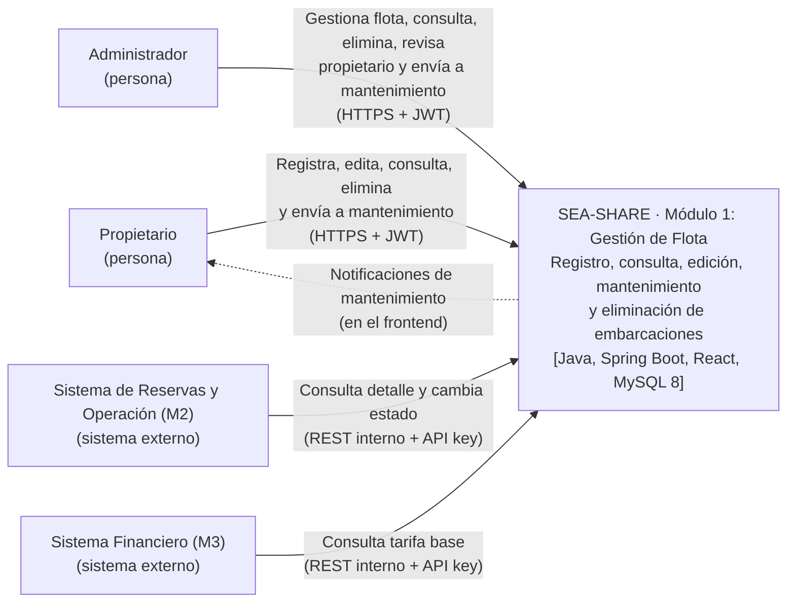

# Implementation Plan: Módulo 1 – Gestión de Flota y Activos P2P (SEA-SHARE)

**Date**: 2026-10-09  
**Spec**: `docs/features/001-…` a `docs/features/009-…` (UC01–UC09). **Única fuente de verdad.**  
**Contratos**: `docs/architecture/contracts/` — Catálogo unificado y especificaciones REST en `rest/`.

---

## Summary

El **Módulo 1** es el inventario comercial central de SEA-SHARE: gestiona el ciclo de vida completo del CRUD de Embarcaciones, Puertos de Atraque, Servicios/Dotaciones y la Máquina de Estados Operativos. Además, expone endpoints internos críticos de consulta y cambio de estado que son consumidos directamente por el Módulo 2 (Reservas y Operaciones) y el Módulo 3 (Sistema Financiero).

Se implementa como una API REST backend independiente utilizando **Spring Boot 4.1.1** bajo **Arquitectura Hexagonal (Clean Architecture)** de tres capas únicas (`domain`, `application`, `infrastructure`), persistencia relacional con **Spring Data JPA** sobre **MySQL 8**, migraciones con **Flyway**, almacenamiento de fotografías en el sistema local, y pruebas de integración aisladas mediante **Testcontainers**.

El frontend (React + Vite) es un proyecto aparte que consume esta API. **Este plan cubre únicamente el backend.**

---

## Technical Context

**Language/Version**: Java 21 LTS (`java.version` 21)

**Primary Dependencies**:

- **Backend Framework**: Spring Boot 4.1.1 (`spring-boot-starter-web`, `spring-boot-starter-data-jpa`, `spring-boot-starter-validation`, `spring-boot-starter-security`, `spring-boot-starter-actuator`).
- **Herramientas de Soporte**: Flyway Migration, MapStruct, Lombok, Bean Validation.
- **Testing & Calidad**: JUnit 5, AssertJ, Mockito, **Testcontainers** (MySQL 8), ArchUnit.

**Storage**:

- Base de datos relacional **MySQL 8** para persistencia.
- Fotografías almacenadas en el sistema de archivos local del servidor (`/uploads/embarcaciones/`), conservando únicamente la ruta relativa en BD. En Docker, esa carpeta se monta como **volumen** en el `docker-compose.yml` para que las fotos sobrevivan a la recreación del contenedor.

**Target Platform**: Contenedores Docker (Linux); desarrollo local con Docker Compose.  
**Project Type**: Servicio API REST Backend independiente (el frontend React + Vite vive en un proyecto separado).

**Constraints**:

- Matrícula legal (`legal_registration`) con formato estricto regex `^CP-\d{2}-\d{4}-[A-Z]$` única a nivel de BD.
- Capacidad de pasajeros entera > 0 con topes por tipo: Lancha ≤ 12, Velero ≤ 15, Catamarán ≤ 30, Yate ≤ 40.
- Tarifa base (`base_rate`) numérica > 0 COP sin límites.
- Fotografía JPG/PNG ≤ 10 MB obligatoria al completar registro y opcional en edición (solo reemplazo). Requiere configurar `spring.servlet.multipart.max-file-size=10MB` y `spring.servlet.multipart.max-request-size=10MB` (el valor por defecto de Spring es 1 MB).
- Servicios base obligatorios (_Capitán_ y _Combustible_) no removibles.
- Matrícula y Tipo bloqueados durante la edición.
- Edición y Eliminación permitidas únicamente en estados _AVAILABLE_ y _MAINTENANCE_.

---

## 1. Alcance y trazabilidad SPEC → Componentes

| UC   | SPEC                           | Quién lo invoca          | Canal           | ¿Responde? | Contrato / Endpoint                                                                                                                                                    |
| ---- | ------------------------------ | ------------------------ | --------------- | ---------- | ---------------------------------------------------------------------------------------------------------------------------------------------------------------------- |
| UC01 | 001 - Registrar embarcación    | Propietario              | REST            | Sí         | `POST /api/v1/fleet/vessels/draft` (paso 1: crea el borrador) `POST /api/v1/fleet/vessels/{vessel_id}/complete` (paso 2: completa el registro y pasa a `AVAILABLE`) |
| UC02 | 002 - Cancelar registro        | Propietario              | REST            | Sí         | `DELETE /api/v1/fleet/vessels/drafts/{vessel_id}`                                                                                                                      |
| UC03 | 003 - Editar información       | Propietario              | REST            | Sí         | `PUT /api/v1/fleet/vessels/{vessel_id}`                                                                                                                                |
| UC04 | 004 - Consultar información    | Propietario / Admin / M2 | REST / Internal | Sí         | `GET /api/v1/fleet/vessels/{vessel_id}` (web) `GET /internal/v1/vessels/{vessel_id}` (internal individual) `GET /internal/v1/vessels` (internal lote/catálogo)   |
| UC05 | 005 - Enviar a mantenimiento   | Propietario / Admin      | REST            | Sí         | `POST /api/v1/fleet/vessels/{vessel_id}/maintenance`                                                                                                                   |
| UC06 | 006 - Eliminar registro        | Propietario / Admin      | REST            | Sí         | `DELETE /api/v1/fleet/vessels/{vessel_id}`                                                                                                                             |
| UC07 | 007 - Asignar estado operativo | Módulo de Reservas (M2)  | Internal REST   | Sí         | `PATCH /internal/v1/vessels/{vessel_id}/status`                                                                                                                        |
| UC08 | 008 - Consultar tarifa base    | Módulo Financiero (M3)   | Internal REST   | Sí         | `POST /internal/v1/fleet/base-rates` (consulta en lote de tarifas)                                                                                                     |
| UC09 | 009 - Revisar propietario      | Administrador            | REST            | Sí         | `GET /api/v1/admin/owners`                                                                                                                                             |

**Soporte transversal (sin UC propio):**

| Función          | Quién lo invoca     | Endpoint                                                               |
| ---------------- | ------------------- | ---------------------------------------------------------------------- |
| Inicio de sesión | Propietario / Admin | `POST /api/v1/auth/login` (público; devuelve el JWT)                   |
| Notificaciones   | Propietario         | `GET /api/v1/notifications` `PATCH /api/v1/notifications/{id}/read` |

---

## 2. Principios Rectores (Derivados de los SPEC)

1. **El Módulo 1 es el dueño de los datos de la embarcación (estado y tarifa)**: M3 solo consulta la tarifa base y nunca la asume. M2 consulta la información de la embarcación y es el responsable de las transiciones de la fase de reserva (Disponible → Reservado → En Navegación); M2 las solicita llamando al endpoint interno de M1, que las valida y las aplica. M1 es responsable de las demás transiciones.
2. **Unicidad de Borradores**: Un propietario solo puede tener un registro incompleto (Borrador) activo a la vez. Si intenta iniciar un registro nuevo teniendo un borrador vigente, el sistema reemplaza o cancela el borrador previo de forma transparente.
3. **Eliminación Lógica Obligatoria**: Las embarcaciones finalizadas nunca se borran físicamente (`DELETE`). Se marcan como inactivas (`is_deleted = true`) para conservar la integridad referencial en M2 y M3.
4. **Máquina de Estados Estricta**: Las transiciones de estado están fuertemente tipadas y validadas a nivel de dominio. Cualquier intento de violar la máquina (ej. Reservado → Mantenimiento) genera una excepción de dominio (`409 Conflict`). El endpoint interno de M2 solo acepta las transiciones que le corresponden.

### 2.1 Máquina de estados

Estados persistidos en `operational_status`: `AVAILABLE`, `RESERVED`, `NAVIGATION`, `MAINTENANCE`. _Borrador_ no es un estado operativo persistido: se representa con `is_draft = true` y `operational_status = DRAFT` o `NULL`.

_(Nota: La API expone los valores en inglés `AVAILABLE`, `RESERVED`, `NAVIGATION`, `MAINTENANCE`, `DRAFT`. El frontend se encarga de presentarlos traducidos en la interfaz de usuario)._

| Desde                       | Hacia         | Quién               | Condición                                 | UC   |
| --------------------------- | ------------- | ------------------- | ----------------------------------------- | ---- |
| `DRAFT` (`is_draft = true`) | `AVAILABLE`   | Propietario         | Completa el segundo formulario con foto   | UC01 |
| `AVAILABLE`                 | `RESERVED`    | M2                  | Inicio de proceso de pago                 | UC07 |
| `RESERVED`                  | `AVAILABLE`   | M2                  | Expiración o cancelación                  | UC07 |
| `RESERVED`                  | `NAVIGATION`  | M2                  | Confirmación de inicio de navegación      | UC07 |
| `NAVIGATION`                | `MAINTENANCE` | Propietario         | Mantenimiento/limpieza al finalizar viaje | UC05 |
| `AVAILABLE`                 | `MAINTENANCE` | Propietario / Admin | Mantenimiento o reporte de anomalía       | UC05 |
| `MAINTENANCE`               | `AVAILABLE`   | Propietario / Admin | Finalización de revisión/mantenimiento    | UC05 |

---

## 3. Arquitectura

### 3.1 Vista de contexto

### 3.2 Decisión de módulos: un dominio, una aplicación, una infraestructura

Se utilizan tres capas únicas dentro de un solo módulo Maven. Las dependencias apuntan siempre hacia el dominio: **infraestructura → aplicación → dominio**. El dominio no conoce a ninguna otra capa, y la aplicación solo conoce interfaces (puertos) que la infraestructura implementa.

| Capa            | Paquete                          | Responsabilidad                                                                                                                                                           |
| --------------- | -------------------------------- | ------------------------------------------------------------------------------------------------------------------------------------------------------------------------- |
| Dominio         | `com.seashare.m1.domain`         | Entidad `Vessel`, entidades `User` y `Notification`, value objects (`Berth`, `LegalRegistration`, etc.), máquina de estados y reglas puras de dominio. Sin Spring ni JPA. |
| Aplicación      | `com.seashare.m1.application`    | Puertos de entrada (casos de uso), servicios de aplicación y puertos de salida (persistencia, almacenamiento). Usa únicamente `@Service` y `@Transactional`.              |
| Infraestructura | `com.seashare.m1.infrastructure` | Adaptadores REST (Web e Internal), adaptadores JPA, almacenamiento local de archivos, seguridad (`Spring Security`, JWT, header `X-Internal-Service-Token`).              |

---

## 4. Modelo de Datos (MySQL 8)

Las migraciones son gestionadas con Flyway. Las relaciones de dominio se mapean a las siguientes tablas:

| Tabla               | Tipo              | Propósito / columnas relevantes                                                                                                                                                                      | Restricciones / Notas                                                                                                                                                           |
| ------------------- | ----------------- | ---------------------------------------------------------------------------------------------------------------------------------------------------------------------------------------------------- | ------------------------------------------------------------------------------------------------------------------------------------------------------------------------------- |
| `users`             | Entidad Auth      | `id`, `username`, `full_name`, `email`, `document_number`, `password`, `role`                                                                                                                        | Usuarios precargados mediante Flyway. `role`: `OWNER`, `ADMIN`.                                                                                                                 |
| `vessel`            | Entidad Principal | `id` PK, `owner_id` FK, `name`, `legal_registration`, `vessel_type`, `max_capacity`, `base_rate`, `photo_path`, `port_name`, `latitude`, `longitude`, `operational_status`, `is_draft`, `is_deleted` | `legal_registration UNIQUE`. `vessel_type`: `MOTORBOAT`, `SAILBOAT`, `CATAMARAN`, `YACHT`. `operational_status`: `DRAFT`, `AVAILABLE`, `RESERVED`, `NAVIGATION`, `MAINTENANCE`. |
| `status_change_log` | Entidad Auditoría | `id`, `vessel_id` FK, `previous_status`, `new_status`, `reservation_id`, `changed_by`, `reason`, `created_at`                                                                                        | Registro inmutable de cada cambio de estado operativo (UC05, UC06, UC07) para auditoría operativa y financiera.                                                                 |
| `notification`      | Entidad           | `id`, `recipient_id` FK, `vessel_id` FK, `title`, `message`, `is_read`, `created_at`                                                                                                                 | Generación de avisos al propietario cuando un Administrador interviene sobre la embarcación.                                                                                    |

---

## 5. Conexiones con otros módulos

| #   | Origen → Destino               | UC   | Estilo           | Transporte            | Contrato                                                                  |
| --- | ------------------------------ | ---- | ---------------- | --------------------- | ------------------------------------------------------------------------- |
| C1  | Reservas (M2) → Sistema (M1)   | UC04 | Request/Response | Internal REST `GET`   | `docs/architecture/contracts/rest/UC04-consultar-informacion-internal.md` |
| C2  | Reservas (M2) → Sistema (M1)   | UC07 | Request/Response | Internal REST `PATCH` | `docs/architecture/contracts/rest/UC07-asignar-estado-operativo.md`       |
| C3  | Financiero (M3) → Sistema (M1) | UC08 | Request/Response | Internal REST `POST`  | `docs/architecture/contracts/rest/UC08-consultar-tarifa-base.md`          |

---

## 6. Aspectos transversales

### 6.1 Seguridad

- **Autenticación Pública**: JWT con verificación de roles `OWNER` y `ADMIN`.
- **Seguridad Interna**: Endpoints bajo `/internal/v1/*` protegidos mediante el header `X-Internal-Service-Token`.
- **Verificación de Propiedad**: `OwnershipCheck` a nivel de aplicación para garantizar que los propietarios solo editen, eliminen o modifiquen sus propias embarcaciones.

### 6.2 Resiliencia y Manejo de Errores

- Control centralizado mediante `@RestControllerAdvice` respondiendo en formato **RFC 9457 (Problem Details)**.
- Transacciones de estado verificadas estrictamente antes de persistir cambios.

---

## 7. Decisiones de Diseño e Invariantes del Sistema

| ID   | Decisión                                                     | Alternativa Descartada        | Justificación                                                                                                                      | SPEC          |
| ---- | ------------------------------------------------------------ | ----------------------------- | ---------------------------------------------------------------------------------------------------------------------------------- | ------------- |
| D-01 | **Arquitectura Hexagonal**                                   | MVC Tradicional por capas     | Desacopla la compleja máquina de estados de JPA y los controladores REST.                                                          | Todos         |
| D-02 | **Testcontainers**                                           | H2 Database en memoria        | Asegura que la concurrencia y los tipos de datos nativos se prueben exactamente como en producción.                                | Todos         |
| D-03 | **Un Borrador por Propietario**                              | Permitir múltiples borradores | Mantiene la BD limpia y cumple con la regla de negocio de reanudar o reiniciar el proceso actual.                                  | 001, 002      |
| D-04 | **Eliminación Lógica (`is_deleted=true`)**                   | Borrado físico `DELETE`       | Necesario para mantener la integridad referencial de los reportes en M2 y M3 de embarcaciones que operaron.                        | 006           |
| D-05 | **Servicios Base Inmutables**                                | Selección manual de servicios | _Capitán_ y _Combustible_ son mandatorios para operar según modelo de negocio; no pueden omitirse.                                 | 001, 003      |
| D-06 | **`Berth` como value object incrustado**                     | Tabla `berth_location` 1:1    | El puerto depende de la embarcación y no se consulta por separado; evita un JOIN innecesario.                                      | 001, 003, 004 |
| D-07 | **Servicios adicionales como columnas booleanas / catálogo** | Múltiples tablas relacionales | Estructura ligera y fidedigna con el catálogo de opciones de dotación.                                                             | 001, 003      |
| D-08 | **Auditoría inmutable en `status_change_log`**               | No guardar auditoría          | Se registra cada cambio de estado operativo (UC05, UC06, UC07) indicando usuario, fecha UTC, estado previo, estado nuevo y motivo. | 005, 006, 007 |
| D-09 | **Salida de mantenimiento según quién lo envió**             | Autorización indeterminada    | Garantiza trazabilidad de revisión según la entidad que forzó la inhabilitación del activo.                                        | 005           |
| D-10 | **API key por módulo para endpoints internos**               | JWT de servicio complejo      | Solución robusta, ligera y segura para comunicación backend-to-backend entre microservicios.                                       | 004, 007, 008 |

---

## 8. Lenguaje Ubicuo (SPEC → Código)

| Término del SPEC            | Identificador en Código                                                                   |
| --------------------------- | ----------------------------------------------------------------------------------------- |
| Embarcación                 | `Vessel`                                                                                  |
| Tipo de embarcación         | `VesselType` (enum: `MOTORBOAT`, `SAILBOAT`, `CATAMARAN`, `YACHT`)                        |
| Puerto de Atraque           | `Berth`                                                                                   |
| Matrícula Legal             | `LegalRegistration` (columna `legal_registration`)                                        |
| Capacidad de pasajeros      | `Capacity` (columna `max_capacity`)                                                       |
| Estado Operativo            | `OperationalStatus` (enum: `DRAFT`, `AVAILABLE`, `RESERVED`, `NAVIGATION`, `MAINTENANCE`) |
| Tarifa Base                 | `BaseRate` (columna `base_rate`)                                                          |
| Borrador                    | `Draft` / `is_draft` flag                                                                 |
| Eliminación (Desactivación) | `is_deleted` flag                                                                         |
| Propietario / Administrador | `Role` (enum: `OWNER`, `ADMIN`)                                                           |
| Notificación                | `Notification`                                                                            |
